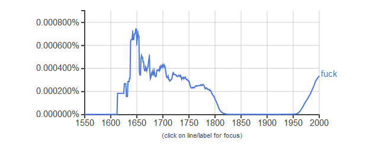
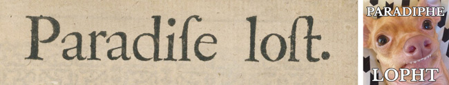

## 4 Strategies for Acquiring Texts

1. Manual Collection
2. Online Databases (e.g., LexisNexis, Proquest, Manifesto Project)
3. Application Programming Interfaces (APIs)
4. Webscraping

---
## 1. Manual Collection

Two ways to to digitize physical texts e.g., archival materials):

1. Manually transcribe, or
2. Use a high-quality scanner and **.accent[optical character recognition (OCR)]** software.
  * **`Tesseract`**: free and open-source OCR tool sponsored by Google that supports over 100 languages. 
  * The `tesseract` package provides bindings in R.

#### Pros
* full control, not limited by availability of a database or API, the structure of a webpage, etc.

#### Cons
* most time-intensive option, especially in the case of manual transcription.

---
## Validate your OCR

.center[

]

--
.center[

]

---
## 2. Online Databases

Services such as LexisNexis, Proquest, and the Manifesto Project provide full texts and metadata in a structured format.

#### Pros
- Data are typically well-structured and more complete.
- Querying the database is usually fast and easy.
- Some universities carry institutional licenses available to researchers.

#### Cons
- Many sources (e.g. Proquest, LexisNexis) are proprietary and copyright protected
- Even with a license, data may be limited in a number of ways. 
  - Nexis Uni & Uchicago: "Downloading text to create a corpus of text for analysis is not permitted under our license."

---
## 2. Online Databases

.center[

]

---
## 3. Web APIs

Researchers query a web API to collect data from social media platforms (Twitter, Facebook), newspapers (New York Times), and other databases (Spotify, Genius, IMDB, etc)

https://www.programmableweb.com/

#### Pros

- Data are well-structured
- Querying an API is relatively fast and easy.

#### Cons

- APIs are only available for select sources. 
- APIs impose rate limits and other restrictions. 

---
## 4. Webscarping

Researchers use a computer program to automatically collect, parse, and store HTML from web pages. 

#### Pros
- Technically, any content that can be viewed on a webpage can be scraped. [Period.](https://blog.hartleybrody.com/web-scraping/)
- No API needed
- No rate-limiting or authentication (usually)

#### Cons
- Rarely tailored for researchers
- Messy, unstructured, inconsistent
- Entirely site-dependent

#### Rule of thumb
- Check for API first. If not available, scrape.

