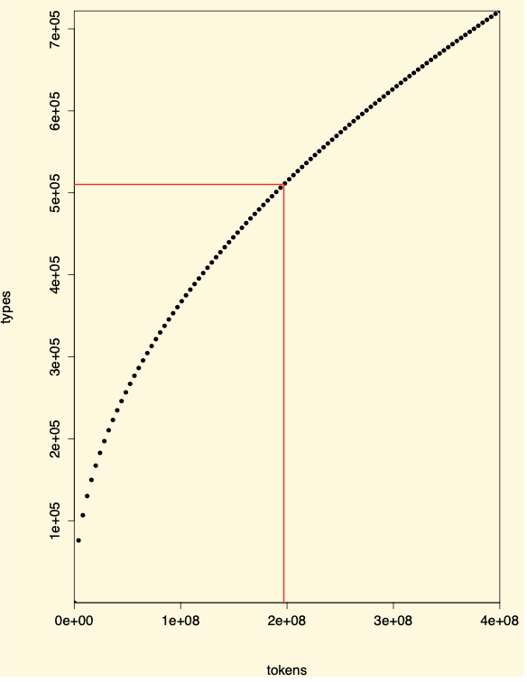
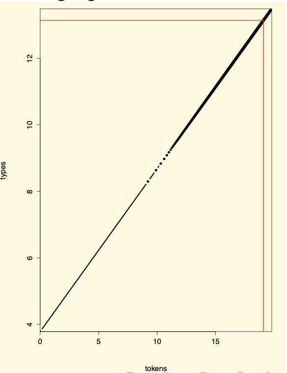
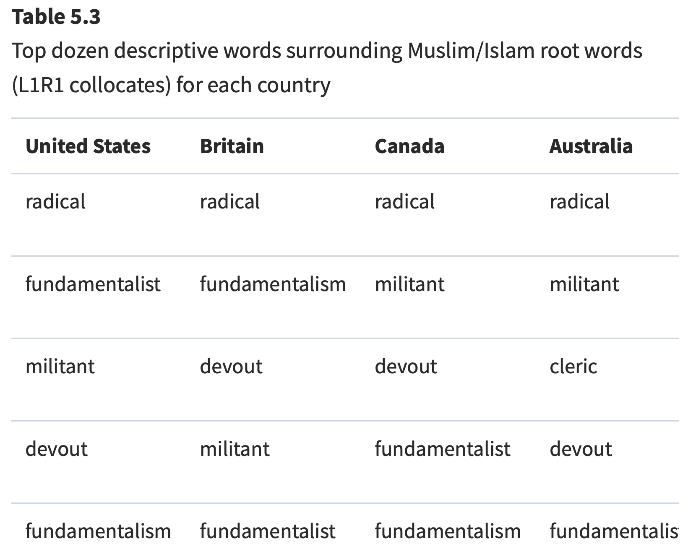
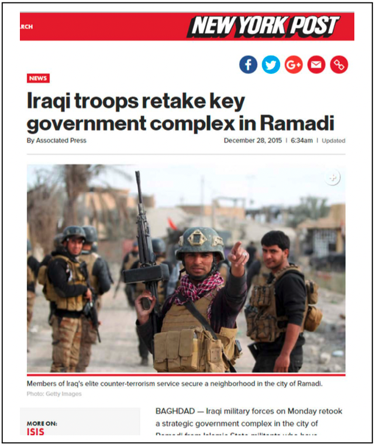
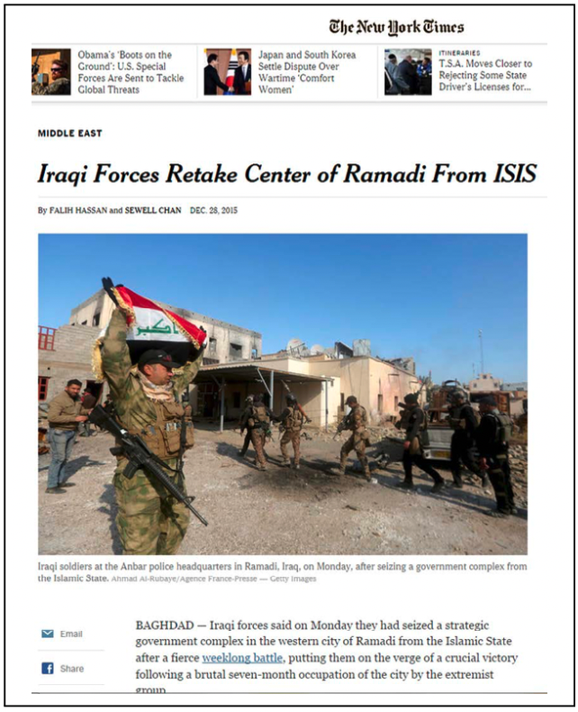
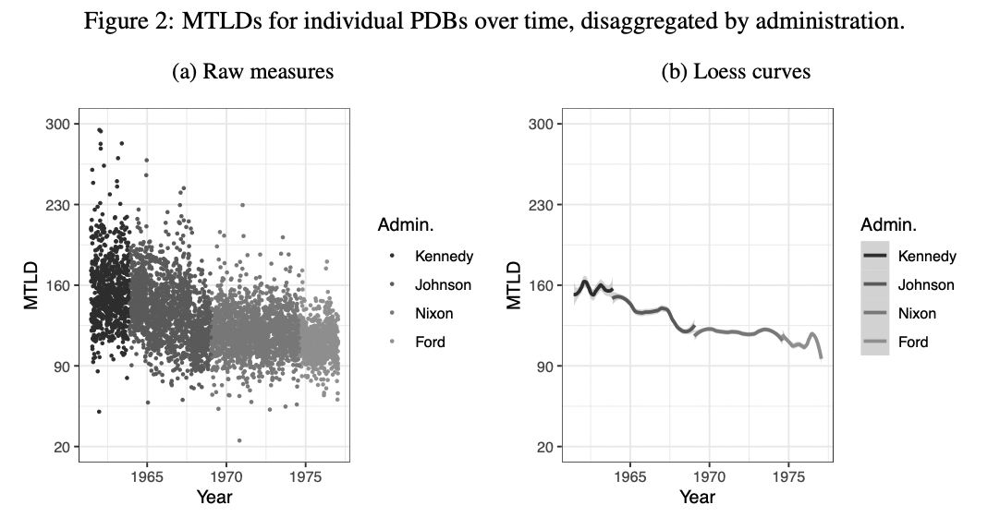
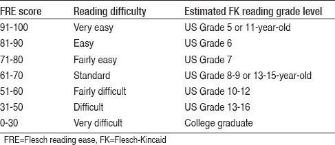
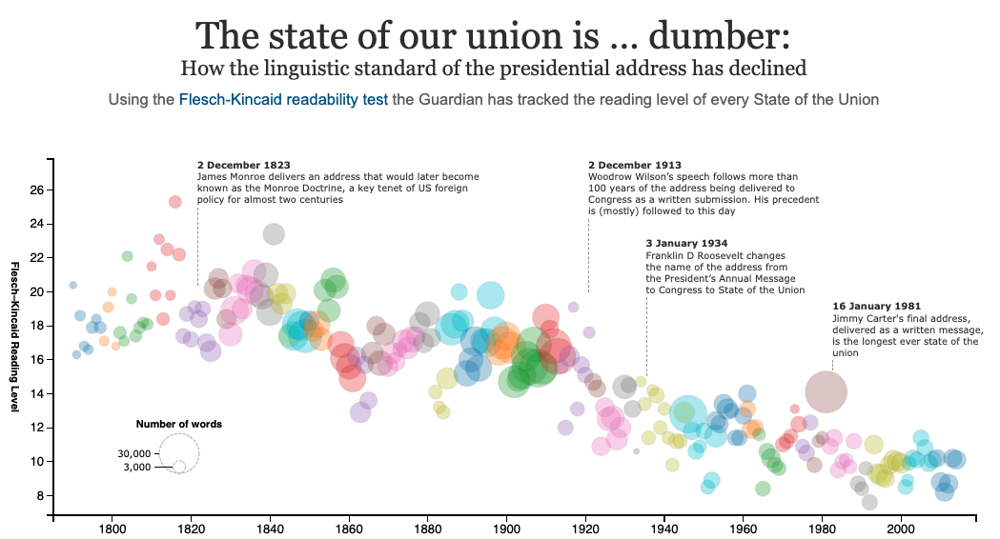
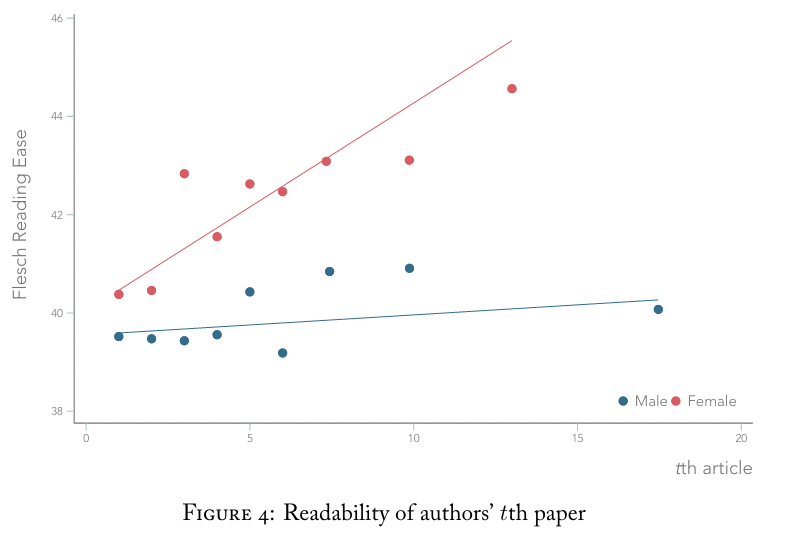

```{r setup, include=FALSE}
knitr::opts_chunk$set(
  comment = "#>",
  collapse = T,
  cache = F,
  out.width = "70%",
  fig.align = 'center',
  fig.width = 6,
  fig.asp = 0.618,  # 1 / phi
  fig.show = "hold"
)
```

```{r include=FALSE} 
# include any code here you don't want to show up in the document,
# e.g. package and dataset loading
require(tidyverse)
require(kableExtra)
require(stringr)
require(quanteda)
```

class: center, middle, inverse, title-slide

## Describing texts

.pull-left[
**Credit**: Remixed from Authur Spirling
]

---
### Describing texts

.pull-left[
#### Key Terms:

- Types-Tokens
- Lossy compression
- Heap's Law
- Zipf's Law
- Co-occurances
- Collocations 
- Phrasemes
- Named entities
- Keywords in Contexts
- Lexical Diversity
- Complexity / Readability
]

.pull-right[
#### Key R Packages
- `quanteda`
]

---
### Types vs. Tokens

.accent[Type]: unique sequence of characters that are grouped together in some meaningful way. Mostly a word (for us), but might also be a word plus punctuation, or a number etc.
  - ex: `France`, `American Revolution`, `1981` 
  - Represents a corpus' **vocabulary** or **unique words**


--
.accent[Token]: a particular instance of type.
  - ex: `Dog eat dog world`, contains 3 types, but 4 tokens.
  - Represents a corpus' **size** or **total words**


--
#### Curse of Dimensionality:
- number of types greatly outpaces the number of observations
- Even a modest corpus of 100 documents can easily contain thousands of unique words. 


---
### Lossy Compression

When we use the .accent[vector space model], we delete information.

This means we cannot restore the original representation of the data: we have a .accent[lossy compression].

This simplifies our by data *a lot*.

--
#### Example:

`Reuters Corpus Volume 1 (RCV1)` (2004) is a benchmark text collection of ∼ 800,000 documents; 484,494 types;  197,879,290 tokens.

| Step | Types | Tokens |
|---|---|---|
| Remove numbers | 473,723 | 179,158,204 |
| Lowercase | 391,523 | 179,158,204 |
| Remove stopwords | 391,373 | 94,516,599 |
| Stemming | 322,383 | 94,516,599 |

.accent[Pop Quiz]: How many stopwords did we remove?

---
### Heap's Law: Type-Token relationship

How does the total number of types ${P}$ change as total number of tokens ${T}$ increases?

.content-box-blue[
**Heap's Law**: ${P} = {kT}^b$
 - In English, $k ∈ (30, 100)$ and $b ∈ (0.4, 0.6)$
 - If we preprocess in different ways, we change $k$
]

---
### Heap's Law: Type-Token relationship

.pull-left[
#### RCV1

]

.pull-right[
#### RCV1: Logged axes

]

---
### Heap's Law: Type-Token relationship

How does the total number of types ${P}$ change as total number of tokens ${T}$ increases?

.content-box-blue[
**Heap's Law**: ${P} = {kT}^b$
 - In English, $k ∈ (30, 100)$ and $b ∈ (0.4, 0.6)$
 - If we preprocess in different ways, we change $k$
]


The number of types increases rapidly at first, then less rapidly. 


---
### Zipf's Law: Relative Frequency of Terms

How frequent is the most frequent term, relative to the second frequent term?

.content-box-blue[
**Zipf's Law**: corpus frequency of ${i}$th most common term is $\alpha \frac{1}{i}$
- 2nd most common term is 1/2 as common as most common,
- 3rd most common term is 1/3 as common as most common,
- 4th most common term is 1/4 as common as most common,
etc
]

#### Natural language follows a power-law distribution.
- We employ a few words quite frequently, while devoting the bulk of our vocabulary to sporadic use

---
### Zipf's Law: Brown's Corpus (1961)

In ~1 million words...

| Term | Frequency | Proportion |
|---|---|---|
| the | 69,836 | 7% |
| of | 36,365 | 3.5% |
| and | 28,826 | 2.8% |
| to | 26,126 | 2.6% |

Only 135 terms $\leadsto$ 50% the Brown Corpus!

---
### Zipf's Law: Other Languages


---
### Collocations

So far, we've modeled texts in a 'bag of words' style. In some cases, we may want to think multi-word expressions.


--
.accent[Collocations:] series of two or more adjacent words that co-occur more often than we would 'expect' by chance.  


--
Collocations are a type of .accent[phraseme] or .accent[idiom]: multi-word utterance where at least one component is constrained or restricted by linguistic convention.


--
.accent[Collocations]: one word is freely chosen, the others are restricted by convention.
- `strong tea` (not `powerful tea`)
- `powerful computer` (not `strong computer`)
- `do business` (not `make business`)
- `make money` (not `do money`)


--
In extreme cases, the meaning of the whole cannot be inferred from the parts:
  - `Was pulling my leg`
  - `At the drop of a hat`

---
### Collocations

#### Why study them?
  - Encode meaning of the text.
  - Might tell us something interesting about history or culture of language.
  - Important when studying .accent[named entities], like people or places.
    - `Prime Minister`, `United States`


--
#### How do we find them?

.accent[Collocation extraction] is a computational technique that finds collocations in a document or corpus


---
### Option 1: Frequency

Frequency of bigrams is not enough (NYT corpus):

</br>

| word 1 | word 2 | frequency |
|---|---|---|
| of | the | 80,871 |
| in | the | 58,841 |
| to | the | 26,430 |
| on | the | 21,842 |
| for | the | 21,839 |

---
### Option 2: Parts-of-Speech

Justeson and Katz (1995) apply .accent[parts-of-speech] tagger to look for:

- **A** Adjectives
- **N** Nouns
- **P** Prepositions

| pattern | example | 
|---|---|---|
| A N  | Prime Minister | 
| N N | surface area | 
| A A N | littel green men | 
| A N N | real estate agent | 
| N P N | Secretary of State | 

---
### Option 2: Parts-of-Speech

Reanalyzing NYT corpus:

</br>

| bigram | pattern | frequency |
|---|---|---|
| New York | A N | 11,487 |
| United States | A N | 7,261 |
| Los Angeles | N N | 5,412 |
| last year | A N | 3,301 |
| vice president | A N | 2,514 |

---
### Option 3: Key Words in Context (KWIC)

How a particular token appears, in terms of the words around it.

</br>

--
```{r echo=F, message=F}
require(quanteda)
require(quanteda.textstats)
corp <- data_corpus_inaugural
toks <- tokens(corp)
kw_immig <- kwic(toks, pattern =  "immigration")
kw <- as.data.frame(head(kw_immig, 5))
kw <- kw %>% dplyr::select(pre, keyword, post)
kable(kw)
```

---
### Option 3: Key Words in Context (KWIC)



[Source](https://academic.oup.com/book/39103)

---
### Option 4: Statistical Tests

How likely are we to see two words together ( ${w}_1 + {w}_2$ ) if they are independent of one another?


--
.accent[Measure of association]: Evaluate whether a co-occurrence occurs by chance or is statistically significant.


--
1. Null hypothesis ( ${H}_0$ ): $P({w}_1, {w}_2)$ = $P({w}_1)P({w}_2)$

--
2. Compare observed events with expected events (under ${H}_0$) $\leadsto$:
  - ${O}_{ij}$: Observed frequencies of word ${i}$ + word ${j}$
  - ${E}_{ij}$: Expected frequencies of word ${i}$ + word ${j}$
  - if difference between observed and expected values is large, reject ${H}_0$.

--
3. If we reject the ${H}_0$, we can take that as evidence for the alternative hypothesis ( ${w}_1 + {w}_2$ is collocation).

---
### Option 4: Statistical Tests

|                 | ${w}_2 =$ `york`   | ${w}_2 \neq$ `york`     | total  |   |
|-----------------|-------------------|----------------------|--------|---|
| ${w}_1 =$ **`new`**  | 303 </br> `New York`      | 240 </br> e.g. `new day`   | 543    |   |
| ${w}_1 \neq$ **`new`** | 6 </br> e.g. `form york` | 909219 </br> e.g. `red eye` | 909225 |   |
| **total**           | 309               | 909459               |  909768      |   |


--
${O}_{New York} = 303$


--
${E}_{New York} = \frac{(309)\times(543)}{909768} = 0.18$


--
With $\chi^2$ test:

  $\leadsto p < 0.001$  

  $\leadsto$ .accent[reject the null hypothesis]: This is a collocation.

---
### Option 4: Statistical Tests

#### Quanteda: Log Likelihood Ratio
- Intuition: if the counts of a particular n-gram are not independent of the particular combination of the n words that comprise it $\Rightarrow$ n-gram is a collocation.
- $\lambda$ is the n-way interaction term from a saturated log-linear model. ${z}$ is from the Wald test z-stat.
- Higher values of $\lambda$ and ${z}$-scores push up rankings of collocations.

From inaugural addresses:
```{r echo=F, message=F}
require(quanteda)
require(quanteda.textstats)
corp <- data_corpus_inaugural
x <- head(cols <- textstat_collocations(corp, size = 5, min_count = 10), 10)
kable(x)
```

---
### Lexical Diversity

.accent[Tokens]: generally words, but they may also include numbers, sums of money, etc.

.accent[Types]: set of unique tokens (aka its **vocabulary**)


--
.accent[Type-to-token ratio (TTR)]: measure of lexical diversity.

.content-box-blue[
$${TTR} = \frac{\text{total types}}{\text{total tokens}}$$
]

.accent[Example]: Authors with limited vocabularies will have a low lexical diversity.

---
### Tabloid vs. Broadsheet

.pull-left[

${TTR} = \frac{250}{491} = 0.51$

]

.pull-right[

${TTR} = \frac{428}{978} = 0.43$
]

#### What's going on?

---
### Lexical Diverity

.accent[TTR is sensitive to text lengths]: 
- shorter texts tend to have fewer repetitions (of e.g. common words).
  - `Do something to serve your country` $\leadsto TTR = 1$
  - `Ask not what your country can do for you, but what you can do for your country` $\leadsto TTR = 0.59$
- but longer documents maybe cover more topics (?)


--
.accent[Correction]: make denominator non-linear: 

.content-box-blue[
**Guiraud index of lexical richness (1954)**

$${R} = \frac{\text{total types}}{\sqrt{\text{total tokens}}}$$
]

.accent[NYP]: $\frac{250}{\sqrt{491}} = 11.28$ ; .accent[NYT]: $\frac{428}{\sqrt{978}} = 13.68$


--
.accent[Advanced Guiraud]: excludes very common words.

---
### Lexical Diversity

.accent[Measure of Textual Lexical Diversity (MTLD)] (McCarthy and Jarvis, 2010): 
- the mean length of sequential word strings in a text that maintain a given TTR value (usually 0.72.)
- the average number of words used in a text before the words begin to repeat themselves. 


--

(Carson and Min 2021)

---
### Linguistic Complexity / Readability

.accent[Motive]: assigning school texts to students of different ages and abilities.


--
Flesch (1948) suggests .accent[Flesch Reading Ease] statistic:
 
 
.content-box-blue[
$${FRE} =  206.835 − 1.015\frac{\text{total words}}{\text{total sentences}} - 84.6\frac{\text{total syllables}}{\text{total words}} $$
Based on linear model where y = average grade level of school children who could correctly answer at least 75% of questions on texts. Scaled s.t. a document with score of 100 could be understood by fourth grader (9yo).

]


--
.accent[Kincaid et al] later translate to US School .accent[grade level] that would be (on average) required to comprehend text.


--
One of .accent[many] such indices: Gunning-Fog, Dale-Chall, Automated Readability Index, SMOG. Typically highly correlated (at text level).

---
### FRE Guidelines

</br>



---
### FRE Examples

</br>

| Score | Text                                             |
|-------|--------------------------------------------------|
| -800  | Molly Bloom's (3.6k word) Sililoque, *Ulysses*   |
| 33    | mean political science article, judicial opinion |
| 45    | life insurance requirement (FL)                  |
| 48    | *New York Times*                                 |
| 65    | *Reader's Digest*                                |
| 80    | children’s books                                 |
| 90    | death row inmate last statements (TX)            |
| 100   | this entry right here.                           |

---
class: middle



Source: Guardian

---
class: middle

### FRE of British MPs, cabinet vs. non-cabinet members 

Second Reform Act (1867) doubled the electorate, mostly to poorer and less educated voters.


[Source: Spirling 2016](https://www.journals.uchicago.edu/doi/10.1086/683612)


---
class: middle

### Readability of econ papers by author gender.


[Source: Hengel 2022](https://www.erinhengel.com/research/publishing_female.pdf)

---
### Linguistic Complexity / Readability

#### What are some potential concerns with FRE?

</br>

.content-box-blue[
$${FRE} =  206.835 − 1.015\frac{\text{total words}}{\text{total sentences}} - 84.6\frac{\text{total syllables}}{\text{total words}} $$
Based on linear model where y = average grade level of school children who could correctly answer at least 75% of questions on texts. Scaled s.t. a document with score of 100 could be understood by fourth grader (9yo).

]
