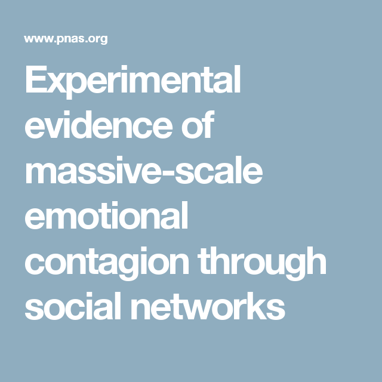

```{r setup, include=FALSE}
knitr::opts_chunk$set(
  comment = "#>",
  collapse = T,
  cache = F,
  out.width = "70%",
  fig.align = 'center',
  fig.width = 6,
  fig.asp = 0.618,  # 1 / phi
  fig.show = "hold"
)
```

```{r include=FALSE} 
# include any code here you don't want to show up in the document,
# e.g. package and dataset loading
require(tidyverse)
require(kableExtra)
require(stringr)
require(quanteda)
```

#### This week 
- Dictionary methods
- Sentiment analysis
- Distinctive / discriminating words
- Scaling using 'wordscores'

---
## Dictionary Methods

#### Goal 
Measure and classify expressed sentiment in texts

#### Game Plan
1. Dictionaries
2. Applying dictionaries to text to measure sentiment
3. Applications, interpretation, and pitfalls

#### Key Terms

- Dictionary
- Sentiment analysis
- Word weights

---
### Dictionaries

.pull-left[
- .accent[Dictionaries]: lists of words belonging to a category.
]

---
### Dictionaries

.pull-left[
- .accent[Dictionaries]: lists of words belonging to a category.
- .accent[Sentiment dictionaries]: Lists of words scored by some emotion or opinion content.
]

.pull-right[

]

---
### Dictionaries

.pull-left[
- .accent[Dictionaries]: lists of words belonging to a category.
- .accent[Sentiment dictionaries]: Lists of words scored by some emotion or opinion content.
  - Broad sentiment (Positive, Negative)
]

.pull-right[

]

---
### Dictionaries

.pull-left[
- .accent[Dictionaries]: lists of words belonging to a category.
- .accent[Sentiment dictionaries]: Lists of words scored by some emotion or opinion content.
  - Broad sentiment (Positive, Negative)
  - Specific emotion (Anger, Joy, Sadness)
]

.pull-right[

]

---
### Dictionaries

.pull-left[
- .accent[Dictionaries]: lists of words belonging to a category.
- .accent[Sentiment dictionaries]: Lists of words scored by some emotion or opinion content.
  - Broad sentiment (Positive, Negative)
  - Specific emotion (Anger, Joy, Sadness)
  - Doesn't include all words (many are neutral)
]

.pull-right[

]

---
### Dictionaries

.pull-left[
- .accent[Dictionaries]: lists of words belonging to a category.
- .accent[Sentiment dictionaries]: Lists of words scored by some emotion or opinion content.
  - Broad sentiment (Positive, Negative)
  - Specific emotion (Anger, Joy, Sadness)
  - Doesn't include all words (many are neutral)  
- .accent[Word weights / scores]
  - Binary: {Positive (+1), Negative (-1)}
]

.pull-right[

]

---
### Dictionaries

.pull-left[
- .accent[Dictionaries]: lists of words belonging to a category.
- .accent[Sentiment dictionaries]: Lists of words scored by some emotion or opinion content.
  - Broad sentiment (Positive, Negative)
  - Specific emotion (Anger, Joy, Sadness)
  - Doesn't include all words (many are neutral)  
- .accent[Word weights / scores]
  - Binary: {Positive (+1), Negative (-1)}
  - Numerical: {−2,−1,1,2}
]

.pull-right[

]

---
### Dictionaries

.pull-left[
- .accent[Dictionaries]: lists of words belonging to a category.
- .accent[Sentiment dictionaries]: Lists of words scored by some emotion or opinion content.
  - Broad sentiment (Positive, Negative)
  - Specific emotion (Anger, Joy, Sadness)
  - Doesn't include all words (many are neutral) 
- .accent[Word weights / scores]  
  - Binary: {Positive (+1), Negative (-1)}
  - Numerical: {−2,−1,1,2}
]

.pull-right[

]

- .accent[Non-sentiment dictionaries]: Words about sports, food, places...

---
### Off the Shelf Dictionaries

1. General Inquirer Database (http://www.wjh.harvard.edu/~inquirer/ )

--
2. Linguistic Inquiry Word Count (LIWC)

--
3. Harvard-IV-4

--
4. Affective Norms for English Words (ANEW)

--
5. Proprietary software (e.g. Diction)

--
6. Many many more...

---
### Generating Dictionaries

Three ways to create dictionaries (non-exhaustive):

--
1. .accent[Statistical methods] (Distinctive / separating words, next class) 2.) 

--
2. .accent[Manual generation]
  - Careful thought (prayer? epiphanies? divine intervention?) about useful words
  - Ex: LIWC: "We drew on common emotion rating scales... Roget's Thesaurus...standard English dictionaries. [then] brain-storming sessions among 3-6 judges were held" to generate other words.

--
3. .accent[Crowdsourcing]: Populations of people who are surprisingly willing to perform ill-defined tasks (Undergraduates, Mechanical Turkers)
  - Example: `{Happy, Unhappy}`
  - Ask turkers: how happy is `elevator`, `car`, `pretty`, `young` 
  - Output as dictionary

---
### Applying Method: Word Weights

- Vector of word counts:  $\boldsymbol{X}_i = (X_{i1}, X_{i2}, \dots, X_{iP})$, $i = (1, \dots, N)$ 

--
- Weights attached to words  $\boldsymbol{\theta} = (\theta_{1}, \theta_{2}, \dots, \theta_{P})$  

--
  - $\theta_{p} \in \{0,1\}$
  - $\theta_{p} \in \{-1, 0, 1 \}$ 
  - $\theta_{p} \in \{-2, -1, 0, 1, 2\}$ 
  - $\theta_{p} \in \Re$


--
For each document $i$ calculate score for document:  

$$
\begin{eqnarray}
Y_i  & = & \frac{\sum_{p=1}^{P} \theta_p X_{ip}}{\sum_{p=1}^{P} X_{ip}}
\end{eqnarray}
$$

--
$Y_{i} \approx$ continuous $\leadsto$ Classification 

  - $Y_i> 0 \Rightarrow$ Positive Category 
  - $Y_i< 0 \Rightarrow$ Negative Category 
  - $Y_i \approx 0$ Ambiguous

---
### Measuring Happiness
.pull-left[

]

.pull-right[
#### Quantifying Happiness: 
- How happy is society?
- How Happy is a Song?
- Blog posts?
- Facebook posts? (Gross National Happiness)

Use .accent[Dictionary Methods]
]

---
### Measuring Happiness

Dodds and Danforth (2009): Use a dictionary method to measure happiness 


--
.accent[Affective Norms for English Words] (ANEW) 
  - Bradley and Lang 1999:  1034 words, Affective reaction to words 
  - On a scale of 1-9 how happy does this word make you? 
  - **Happy**: `triumphant` (8.82); `paradise` (8.72); `love` (8.72) 
  - **Neutral**: `street` (5.22); `paper` (5.20); `engine` (5.20) 
  - **Unhappy**: `cancer` (1.5); `funeral` (1.39); `rape` (1.25); `suicide` (1.25)  


--
.accent[Happiness] for text $i$ (with word $p$ having happiness $\theta_p$ and document frequency $X_{ip}$

$$
\begin{eqnarray}
\text{Happiness}_{i}  & = & \frac{ \sum_{p=1}^{P} \theta_{p} X_{ip} } { \sum_{p=1}^{P} X_{ip}}  
\end{eqnarray}
$$

---


--
Happiest Song on Thriller?  

--
.accent[P.Y.T. (Pretty Young Thing)]   (This is the right answer!)}

---
### Happiness in Society


---
### Happiness in Society


---
### Happiness in Society


https://towardsdatascience.com/lyrics-analysis-5e1990070a4b

---
### Happiness in Society


---
### Visualizing Plots: Romeo & Juliet


---
### Emotional Contagion on Facebook



---
### Emotional Contagion on Facebook


---
# Use with caution!

- Most dictionary methods do not take into account qualifiers (e.g. "no good").
- Ignores sarcasm, irony, nuance.
- Dictionaries are .accent[context dependent].

---
### Validation, Dictionaries from other Fields

--
.accent[Accounting Research]: measure tone of 10-K reports 
  - **tone** matters ($)


--
Previous state of art: Harvard-IV-4 Dictionary applied to texts Loughran and McDonald (2011). 


--
.accent[Financial Documents are Different] $\leadsto$ **polysemes**

--
  - Negative words in Harvard, Not Negative in Accounting:
    `tax, cost, capital, board, liability, foreign, cancer, crude (oil), tire`

--
  - .accent[73%] of Harvard negative words in this set(!!!!!)

--
  - Not Negative Harvard, Negative in Accounting: `felony, litigation, restated, misstatement, unanticipated`
  
  
  
--
.accent[Context Matters!]

---
class: middle

**`R Code!`**