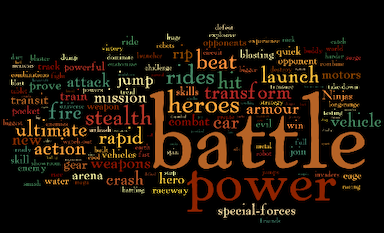
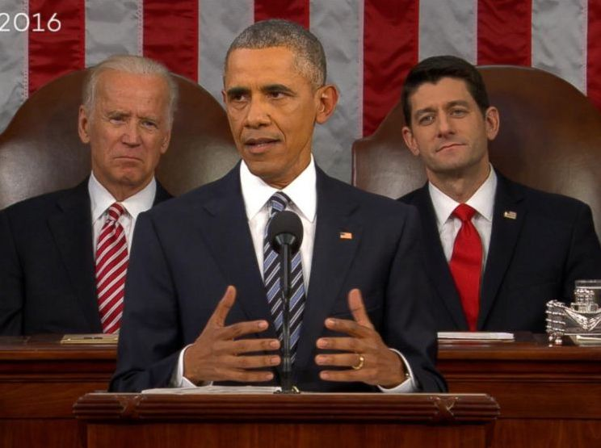
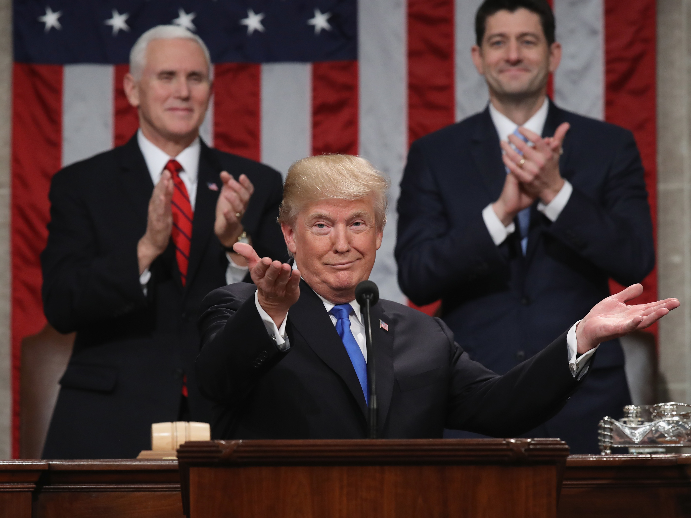
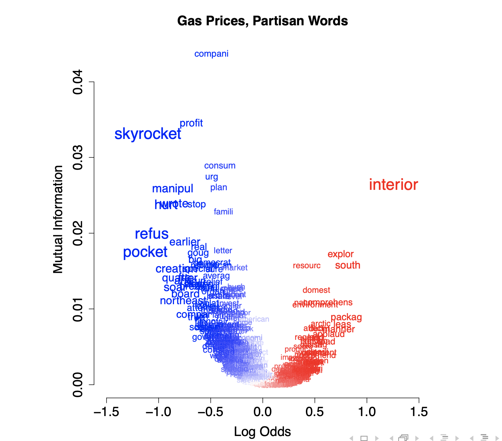
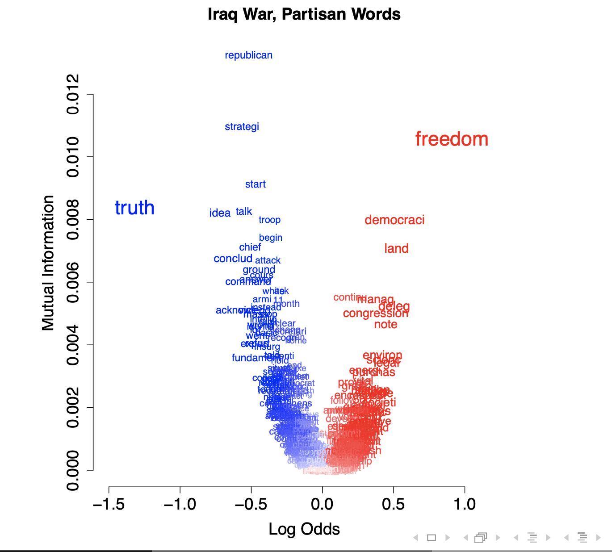
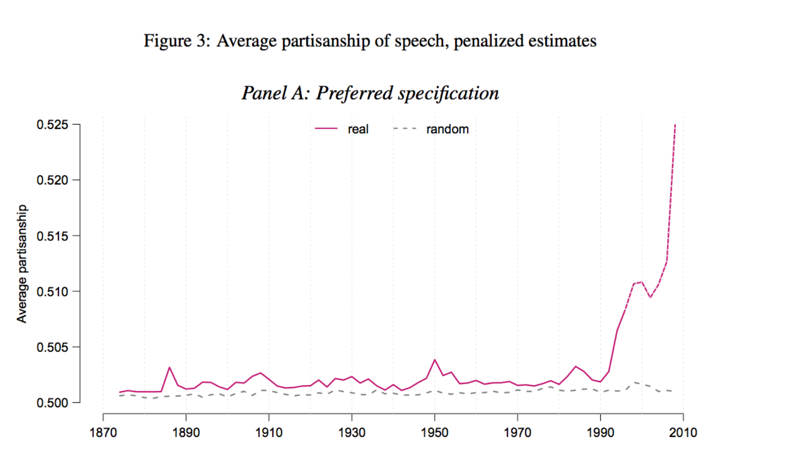
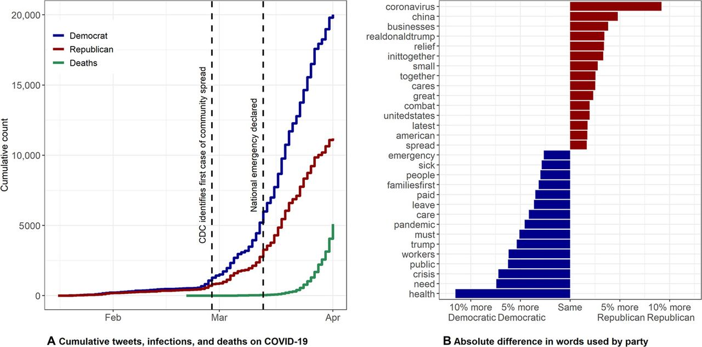

```{r setup, include=FALSE}
knitr::opts_chunk$set(
  comment = "#>",
  collapse = T,
  cache = F,
  out.width = "70%",
  fig.align = 'center',
  fig.width = 6,
  fig.asp = 0.618,  # 1 / phi
  fig.show = "hold"
)
```

```{r include=FALSE} 
# include any code here you don't want to show up in the document,
# e.g. package and dataset loading
require(tidyverse)
require(kableExtra)
require(stringr)
require(quanteda)
```


#### This week 
- Dictionary methods
- Sentiment analysis
- Distinctive / discriminating words
- Scaling using 'wordscores'

---
### Review of Dictionary Methods

.accent[Last lesson]: Dictionary methods
- Use lists of words to score documents, e.g. positive or negative.


--
.accent[Problem]: How do generate dictionaries? 

--
- Manually 

--
- Crowd sourcing 

--
- Statistical methods $\leadsto$ **discriminating words.**

---
### Discriminating Words

.accent[Goal]: Find words that distinguish one group of texts from another group of texts.
- Comparing Republican, Democratic speeches $\leadsto$ .accent[Partisan] language 
- Comparing Liberal, Conservative books $\leadsto$ .accent[Ideological] language
- Comparing in toy advertising $\leadsto$ .accent[Gendered] language

---
### Gendered language




</br>


---
### Discriminating Words

.accent[Goal]: Find words that distinguish one group of texts from another group of texts.
- Comparing Republican, Democratic speeches $\leadsto$ .accent[Partisan] language 
- Comparing Liberal, Conservative books $\leadsto$ .accent[Ideological] language
- Comparing in Toy advertising $\leadsto$ .accent[Gendered] language

.accent[Reasons]
1. Interesting in their own right 
2. Create custom dictionaries for classification task.
3. Feature selection: inclusion of features in some subsequent analysis


--
.accent[Method]: Distinctive / Discriminating / Separating word scores. 

---
### Example: State of the Union speeches by Presidents Obama and Trump.

.pull-left[

]

.pull-right[

]


--
.accent[Goal]: find words (or features) that are distinctive to each category.


---
### What does "distinctive" mean?

Given usage of a word $p$ in document $i$, how well can I guess the category $Y_i$ ?

--
  - Maximally distinctive $\rightarrow$ perfect predictor.   
     $\boldsymbol{P}(Y_i = Obama | X_{ip}) = 1$ or $\boldsymbol{P}(Y_i = Obama | X_{ip}) = 0$

--
  - Minimally distinctive $\rightarrow$ fails to separate categories.  
     $\boldsymbol{P}(Y_i = Obama | X_{ip}) = 0.5$


--
.accent[The Set Up]:

--
- Labels: $\boldsymbol{Y} = (Y_1, Y_2, Y_3, \dots, Y_n) =$ (Obama, Obama, Trump, $\dots$ Obama.)

--
- Vector of word counts: $\boldsymbol{X}_i = (X_{i1}, X_{i2}, \dots, X_{ip})$

--
- Weights attached to words: $\boldsymbol{\theta} = (\theta_{1}, \theta_{2}, \dots, \theta_{P})$ 


--
.accent[Objective function]: find $\boldsymbol{\theta}^{*} = (\theta_{1}^{*}, \theta_{2}^{*}, \dots, \theta_{P}^{*})$ used to create score:
$$Y_{i} = \sum_{p=1}^{P} \theta_{p}^{*} X_{ip}$$
that maximally discriminates between categories. 


--
.accent[Higher] $|\theta_{p}^{*}| \rightarrow$ .accent[better discrimination.]


---
class: middle

### How do we fit $\boldsymbol{\theta}^{*}$ ????

---
### Option 1: Unique usage

.accent[Distinctive = exclusive]
- If Obama uses the word `access` and Trump never does, we should count `access` as distinctive.
- These words tend not to be terribly interesting or informative

---
### Option 2: Difference in Frequencies

.accent[Distinctive = difference in frequency] 
- Compare the number of times each speaker uses a word.
- Find the largest absolute difference. 
- Doesn't take into account difference in total words.

---
### Option 3: Difference in Averages

.accent[Distinctive = difference in rates]

--
1. Normalize DTM from counts to proportions:  

  For each word $p$ in an arbitrary corpus $c$:  
  
  $$\mu_{p} = \frac{\sum_{i=1}^{N}p_i}{T}$$

  where $p_i$ is the number of times a $p$ appears in document $i$, $N$ is the total number of documents in $c$ and $T$ is the total number of words in $c$. 

--
2. Take the difference between one speaker's proportion of a word and another's proportion of the same word.

  $$\boldsymbol{\theta}^{*} = \mu_{p, Obama} - \mu_{p, Trump}$$

--
3. Find words with highest absolute difference.

---
### Difference in Averages: Problems 

1. Favors more frequent words.  
  **Word 1**: 30/1000 (Obama); 25/1000 (Trump) $\leadsto \theta_{1} = 5/1000$.  
  **Word 2**: 5/1000 (Obama); .1/1000 (Trump) $\leadsto \theta_{2} = 4.9/1000$.

--
2. Ignores cases when one speaker uses a word frequently and a another speaker barely uses it.

--
3. More generally: Differences in rates of frequent words $>$ Differences in rates of rare words.


--
#### Adjustments: 
  - Remove stop words.
  - Divide the difference in speakers' average rates by the average rate across all speakers.


---
### Other options

#### Other metrics for "distinctiveness":
- Standardized Mean Difference (later slides)
- Standard Log Odds (used in Monroe, Colaresi, and Quinn, 2009)
- chi-squared test
- Many more!


--
#### How do we choose?
- Depends on context, goal
- Classification $\leadsto$ accuracy, precision, recall
- Qualitative inference $\leadsto$ face validity, convergence, etc.
- More on this later (at the end of slides)

---
### Stylometry: Who Wrote Disputed Federalist Papers?

#### Federalist Papers:
- Canonical texts in study of American politics
- Designed to persuade citizens of New York to adopt constitution
- 77 essays, published from 1787-1799 in newspapers, published .accent[anonymously] under the name Publius.


--
####  Who wrote the Federalist papers? (Hostler and Wallace (1963) 
- Jay: wrote 5 essays
- Hamilton: wrote 43 papers
- Madison: wrote 12 papers
- .accent[Disputed (Hamilton or Madison?)]: Essays 49-58, 62, and 63 


--
.accent[Task]: Identify author of disputed papers


--
.accent[Method]: 
- Identify distinctive words of Hamilton and Madison
- Use those words to classify disputed papers with dictionary methods


---
### Stylometry: Who Wrote Disputed Federalist Papers?

.accent[Training] $\leadsto$ papers Hamilton, Madison are known to have authored

.accent[Test] $\leadsto$ disputed (i.e. unlabeled) papers 

.accent[Preprocessing]:  
- Hamilton/Madison discuss similar themes
- Differ on the extent they use **stop words**
- Focus analysis on the stop words

---
### Word Weights: Standardized Mean Difference

For each word $p$, construct weight $\boldsymbol{\theta}^{*}$, 

$$
\begin{eqnarray}
\mu_{p, \text{Hamilton}} & = & \text{Rate}(p) \text{ in subcorpus of Hamilton docs} \nonumber \\
\mu_{p, \text{Madison}} & = & \text{Rate}(p) \text{ in subcorpus of Madison docs} \nonumber \\
\sigma^{2}_{p, \text{Hamilton}} & = & \text{Var}(p)  \text{ in subcorpus of Hamilton docs}\nonumber \\
\sigma^{2}_{p \text{Madison} }& = & \text{Var}(p) \text{ in subcorpus of Madison docs} \nonumber
\end{eqnarray}
$$


--
We can then generate weight $\boldsymbol{\theta}^{*}$ as 

$$
\begin{eqnarray}
\boldsymbol{\theta}^{*} &= & \frac{\mu_{p, \text{Hamilton}}  - \mu_{p, \text{Madison}}  } {\sqrt{\sigma_{p, \text{Hamilton}}^{2} + \sigma_{p, \text{Madison}}^{2} }   }  \nonumber 
\end{eqnarray}
$$


--
Then trim the dicitonary:
- Trimming weights: Focus on discriminating words (very simple .accent[regularization])
- Cut off: For all $|\boldsymbol{\theta}^{*}|<0.025$ set $\boldsymbol{\theta}^{*} = 0$.  


---
### Classification: Determining Authorship

For each disputed document $i$, compute discrimination statistic

$$
\begin{eqnarray}
Y_{i}  & = & \sum_{p =1}^{P} \theta^{*}_{p} X_{ip} \nonumber 
\end{eqnarray}
$$


--
$Y_i \leadsto$ classification (.accent[linear discriminator])
- Above midpoint in training set $\rightarrow$ Hamilton text
- Below midpoint in training set $\rightarrow$ Madison text


.accent[Findings]: Madison is the author of the disputed federalist papers.  

---
### Partisan Language

#### Monroe, Colaresi, and Quinn (2009):

How do Republicans and Democrats differ in debate? 

Condition on topic and examine word usage
- Press Releases (64,033)
- Topic Coded
- Given press release is about .accent[topic], what are the features that distinguish Republican and Democratic language?

.accent[Method]: Log Odds Ratio, weighted by variance

https://gist.github.com/thiagomarzagao/5851207

---


---


---
### Partisan Language

#### Gentzkow, Shapiro, and Taddy (2017)


---
### Partisan Language

#### Green et al (2020)


---
### Evaluation for Dictionary Methods & Distinctive Words

- How do we choose between different "distinctive word" metrics?
- How do we chose between dictionaries? 
- How do we evaluate our findings? 


--
#### Three evaluation strategies} 
- Face validity (do these results make sense?)
- Convergence (do different metrics lead to the same result?)
- "Gold Standard" (do our results align with human coding?)  
  - More on this next week


---
class: middle

**`R Code!`**