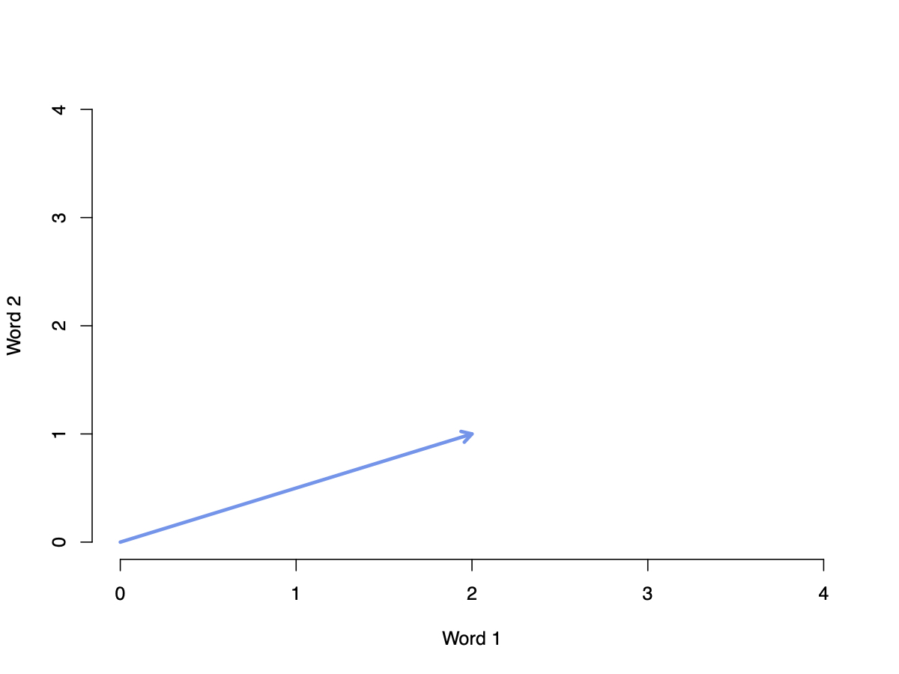
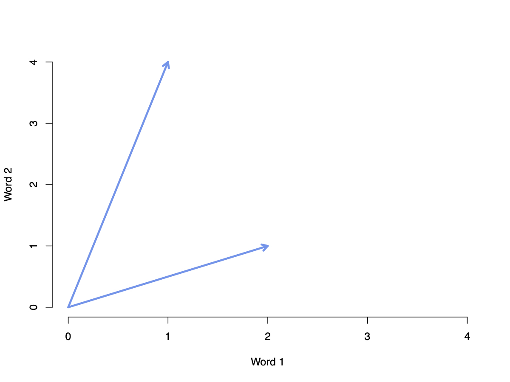
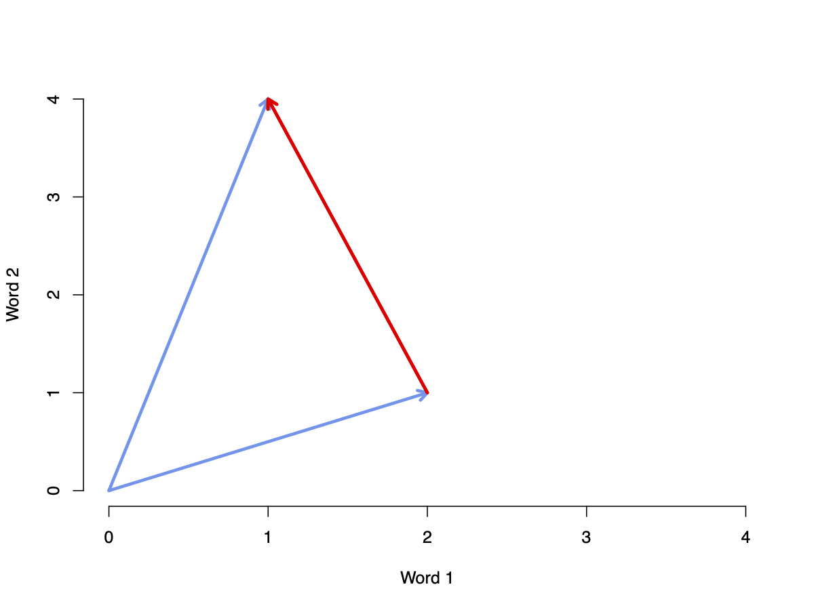
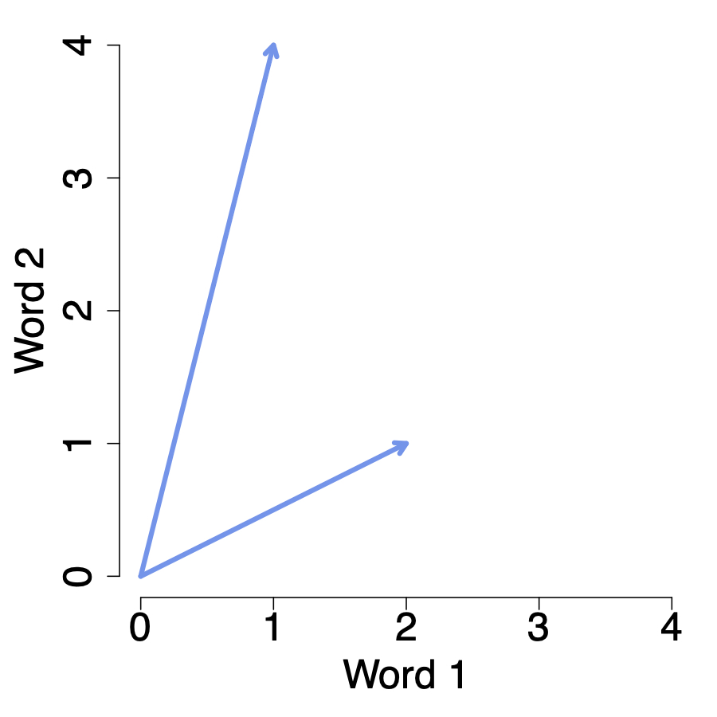
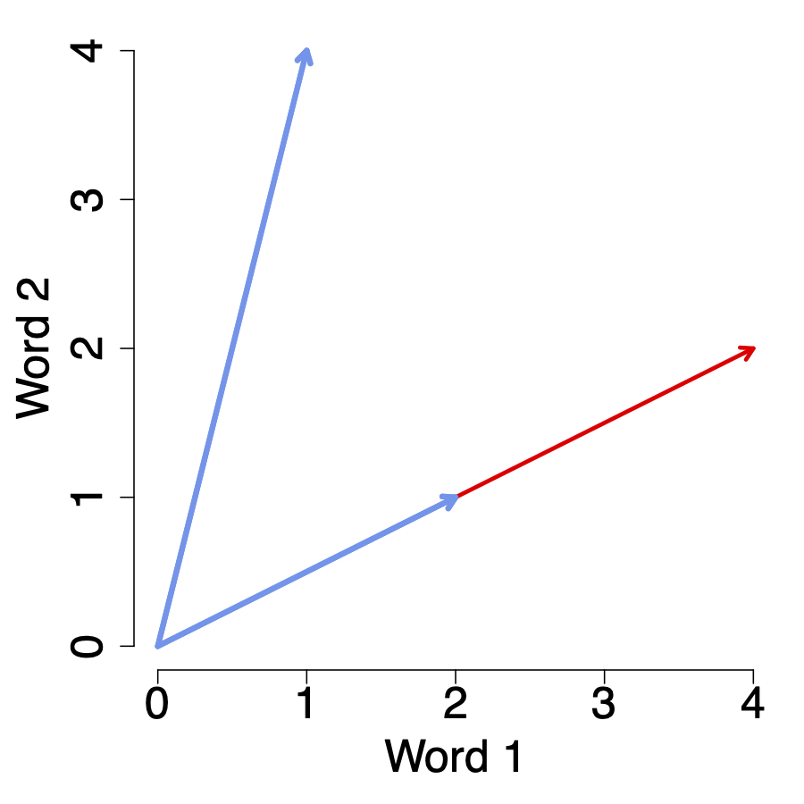
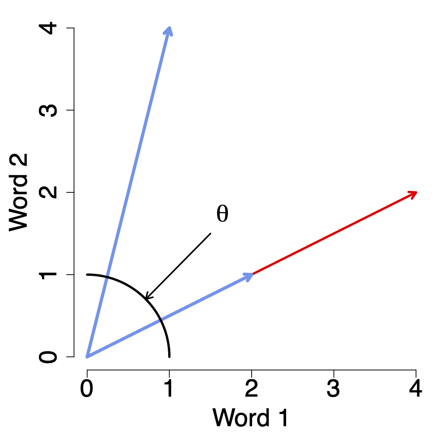
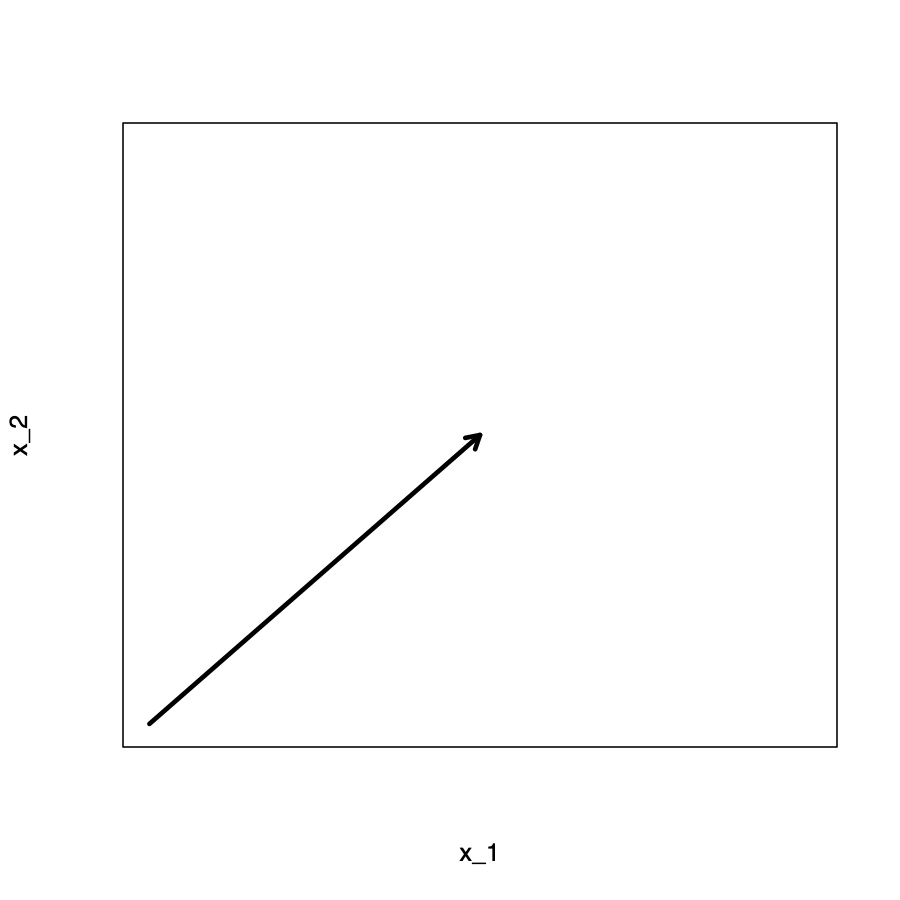
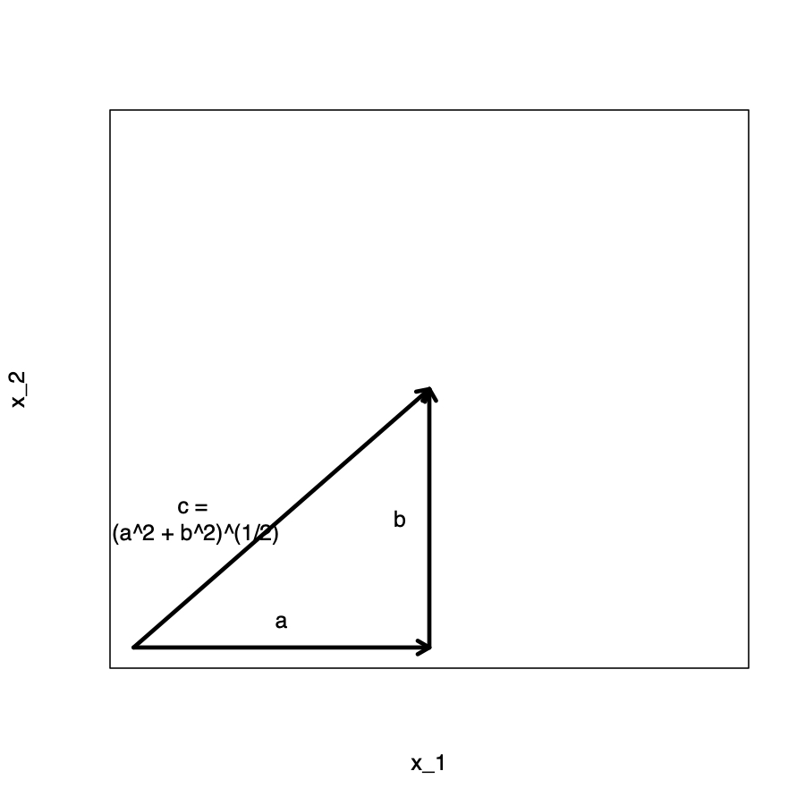

```{r setup, include=FALSE}
knitr::opts_chunk$set(
  comment = "#>",
  collapse = T,
  cache = F,
  out.width = "70%",
  fig.align = 'center',
  fig.width = 6,
  fig.asp = 0.618,  # 1 / phi
  fig.show = "hold"
)
```

```{r include=FALSE} 
# include any code here you don't want to show up in the document,
# e.g. package and dataset loading
require(tidyverse)
require(kableExtra)
require(stringr)
require(quanteda)
```


## Two broad approaches


--
### Supervised methods

We identify what we’re interested in first, and then use computers to extend our insights to a larger population of unseen documents.


--
### Unsupervised methods 

We do not specify the conceptual structure of the texts beforehand. Instead, we use the model to discover a structure that best explains the documents.

---
### Components to Unsupervised Learning Method

.accent[Unsupervised methods]: Discover new ways of organizing texts that are theoretically useful, but perhaps understudied or previously unknown.

--
1. Set of unlabeled documents that we want to classify

--
2. Method to discover categories and then classify documents into those
categories (k-means clustering, topic models)

--
3. Interpretation skills to assign labels to categories and understand what they mean.

---
### Cluster analysis / Clustering

- Goal is to ascertain, on the basis of $x_1, x_2, ..., x_n$ , whether the observations fall into relatively distinct groups.

- These groups are interesting because the may correspond to some category or quantity of interest.

---
class: middle, center

```{r echo=F}
knitr::include_graphics("img/clustering.png")
```

---
class: middle, center

```{r echo=F, out.width="100%"}
knitr::include_graphics("img/JeffFlakeBanner.jpg")
```

---
### Game Plan

.accent[Today]: Cluster press releases

</br>
.accent[Goal]: partition documents such that:
- similar documents are together 
- dissimilar documents are apart

</br>
.accent[Method]: Clustering methods 
1. What makes two data points (i.e. documents) similar? 
2. How do we find a good partition?
3. How do we interpret the clusters?

---
### Key Terms
- (Multidimensional) Space
- Distance
- Euclidean Distance
- Cosine Distance
- Cluster Analysis / Clustering 
- K-means
- Centroid

---
class: middle, center, inverse, title-slide

## Text Distance and Similarity

---
class: middle

### What makes two documents similar?

- Similar use of language $\leadsto$ .accent[complicated] 
- Similar word count vectors $\leadsto$ .accent[simple]  


--
.large[Similar = Geometrically .accent[Close]] 

.large[Dissimilar = Geometrically .accent[Distant]]

---
### Texts and Geometry

Consider a document-term matrix: 

<div class="math">
\begin{eqnarray}
\boldsymbol{X} & = & 
\begin{pmatrix}
1 & 2 & 0 & \dots & 0 \\
0 & 0 & 3 & \dots & 0 \\
\vdots & \vdots & \vdots & \ddots & \vdots \\
1 & 0 & 0 & \dots & 3 \\
\end{pmatrix} 
\end{eqnarray} 
</div>


By transforming our text into a word count vector, we are representing it as a point in a multidimensional .accent[space] 


--
- Provides a .accent[geometry] 


--
- Natural notions of .accent[distance] and .accent[similarity]


--
- Tools from .accent[linear algebra] to calculate distances mathematically.

---
### Texts in Space

```{r echo=F}

```

Doc1 = "Wait? No wait." $\leadsto (2, 1)$

---
### Texts in Space

```{r echo=F}

```

Doc1 = "Wait? No wait." $\leadsto (2, 1)$

Doc2 = "No, wait! No, no, no!"  $\leadsto (1, 4)$ 

---
### Texts in Space

```{r echo=F}

```

Doc1 = "Wait? No wait." $\leadsto (2, 1)$

Doc2 = "No, wait! No, no, no!"  $\leadsto (1, 4)$ 


---
### Euclidean Distance

Suppose $\boldsymbol{X}_{1} = (1, 4)$ and $\boldsymbol{X}_{2} = (2, 1)$ .  


--
The .accent[Euclidean distance] (aka .accent[norm]) between $\boldsymbol{X}_{1}$ and $\boldsymbol{X}_{2}$ (or from $\boldsymbol{X}_{1}$ and $\boldsymbol{X}_{2}$ ) is the length of the line segment connecting them. 

--
<div class="math">
\begin{eqnarray}
d(\boldsymbol{X}_{1}, \boldsymbol{X}_{2} ) = d(\boldsymbol{X}_{2}, \boldsymbol{X}_{1}) & = & \sqrt{ (x_{1,1} - x_{2,1} )^2 + (x_{1,2} - x_{2,2})^2} \\ 
& = & \sqrt{ (1 - 2 )^2 + (4 - 1)^2}  \\ 
& = & \sqrt{10}    
\end{eqnarray}
</div>


--
.accent[This generalizes beyond 2 dimensions!] 

--
<div class="math">
\begin{eqnarray}
d(\boldsymbol{X}_{1}, \boldsymbol{X}_{2} )   & = & \sqrt{\left(x_{1,1} -  x_{2,1} \right)^2 + \left(x_{1,2} - x_{2,2} \right)^2 + \cdots  + \left(x_{1,p} -  x_{2,p} \right)^2}   \\ 
 & = & \sqrt{\sum_{p=1}^{P} \left(x_{1p} -  x_{2p} \right)^2}  
\end{eqnarray}
</div>


---
### Test your knowledge

The Euclidean distance between any documents $\boldsymbol{X}_{1}$ and $\boldsymbol{X}_{2}$ is: 

<div class="math">
\begin{eqnarray}
d(\boldsymbol{X}_{1}, \boldsymbol{X}_{2})  & =  & \sqrt{\sum_{p=1}^{P} \left(x_{1p} - x_{2p} \right)^2}  
\end{eqnarray}
</div>


--
Suppose:
- $\boldsymbol{X}_{1} = \text{Oh na na na.}$ 
- $\boldsymbol{X}_{2} = \text{Oh, me? Na.}$

Calculate the euclidean distance between these two documents. 

---
### Problem(?) with Euclidean Distance

.pull-left[
```{r echo=F}

```
]

.pull-right[

<div class="math">
\begin{eqnarray}
\boldsymbol{X}_{1} & = &  (2,1) \\
\boldsymbol{X}_{2} & = & (1,4)  \\
d(\boldsymbol{X}_{1}, \boldsymbol{X}_{2} ) & = & \sqrt{ (1 -2 )^2 + (4 - 1)^2 } \\
& = & \sqrt{10}   
\end{eqnarray}
</div>

]

---
### Problem(?) with Euclidean Distance

.pull-left[
```{r echo=F}

```
]

.pull-right[

<div class="math">
\begin{eqnarray}
\boldsymbol{X}_{1} & = &  (2,1)\nonumber \\
\boldsymbol{X}_{2} & = & (1,4) \nonumber \\
\boldsymbol{X}_{3} & = & 2 \boldsymbol{X}_{1} = (4, 2) \nonumber \\
d(\boldsymbol{X}_{3}, \boldsymbol{X}_{2} ) & = & \sqrt{ (4 - 1)^2 + (2 - 4)^2}  \nonumber \\
& = & \sqrt{13} \nonumber 
\end{eqnarray}
</div>

.accent[Euclidean distance depends on document-length.]

]

---
### Cosine Similarity

.pull-left[
```{r echo=F}

```
]

.pull-right[
- Takes into consideration documents length. 
- Measures .accent[cosine] of the angle ( $\theta$ ) between vectors. 
- Measure of similarity (rather than distance) ranging between 0 and 1. 
- To convert to distance (or dissimilarity), take $1 - \cos \theta$ . 
]


---
### Vector Length

.pull-left[
```{r echo=F, out.width="100%"}

```
]

.pull-right[

]

---
### Vector Length

.pull-left[
```{r echo=F, out.width="100%"}

```
]

.pull-right[
.accent[Pythagorean Theorem]: 
- Side with length $a$
- Side with length $b$ and right triangle
- $c = \sqrt{ a^2 + b^2}$
- **Extends beyond 2 dimensions**
]

---
### Vector (Euclidean) Length 

Suppose $\boldsymbol{X}_{i}$ is a document (row from an $N \times K$ document-term matrix). 

Then, we will define its .accent[length] as 

<div class="math">
\begin{eqnarray}
||\boldsymbol{X}_i|| & = & \sqrt{(\boldsymbol{X}_{i} \cdot \boldsymbol{X}_{i} )} \nonumber \\
	& = & \sqrt{(X_{i1}^2 + X_{i2}^{2} + X_{i3}^{2} + \dots + X_{iK}^{2} )} \nonumber \\
						   & = & \sqrt{\sum_{k=1}^{K}  X_{ik}^2} \nonumber 
\end{eqnarray}						   
</div>


---
### Cosine Similarity

<div class="math">
\begin{eqnarray}
\cos \theta & = & \frac{X_1}{||X_1||}  \cdot \frac{X_2}{||X_2||} \\ 
\\
\frac{(4,2)}{||(4,2) ||} & = & (0.89, 0.45) \\
\\
\frac{(2,1)}{||(2,1) || } & = & (0.89, 0.45) \\
\\
\frac{(1,4)} {||(1,4)||}  & = & (0.24, 0.97)  \\
\\
(0.89, 0.45)\cdot (0.24, 0.97) & = & 0.65 \\
\\
\cos\text{dissimilarity}  & = &  1 - \cos \theta  
\end{eqnarray}
</div>

---
### Review

#### What makes two data points (i.e. documents) similar?

--
- Similar = Geometrically close
- Euclidean distance
- Cosine distance
- Many more! (as always...) 


--
#### Why do we care?
- Distances $\leadsto$ clustering.
- Other applications 
  - Plagiarism,
  - Diffusion of policy 


--
#### Next Up
- How do we find a good partition?
- How do we interpret the clusters?

---
class: middle

## To $\texttt{R}$ Code!
