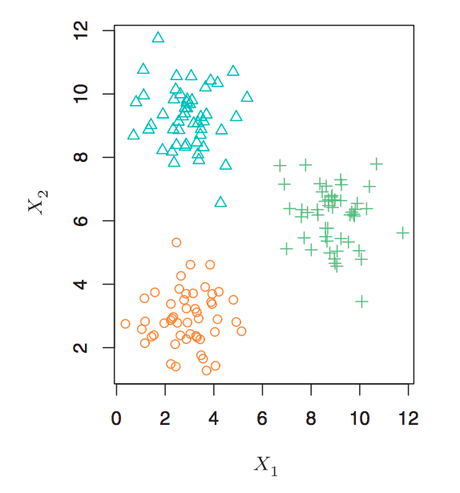
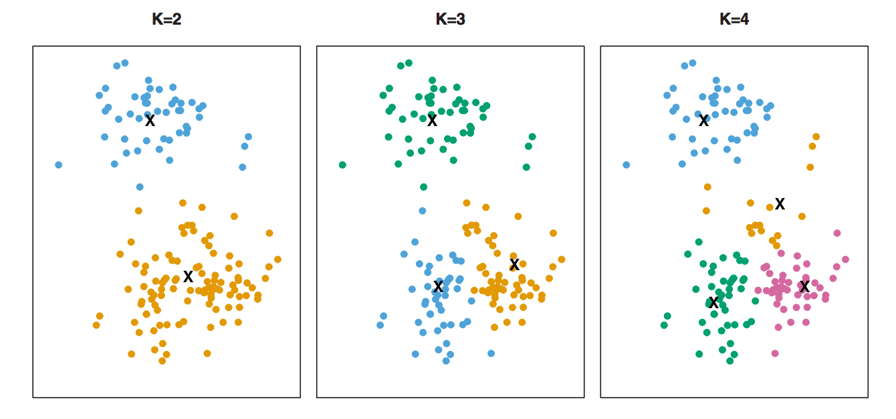
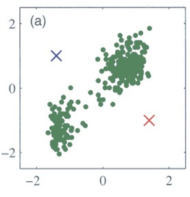
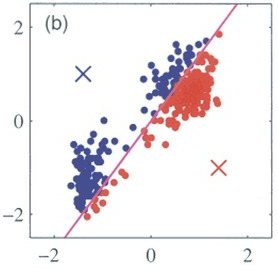
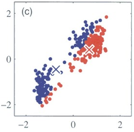
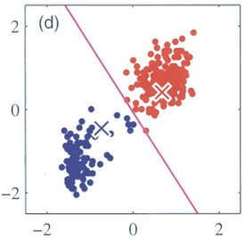
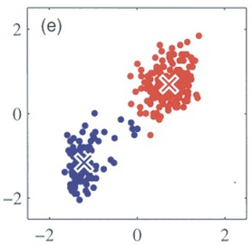
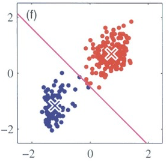
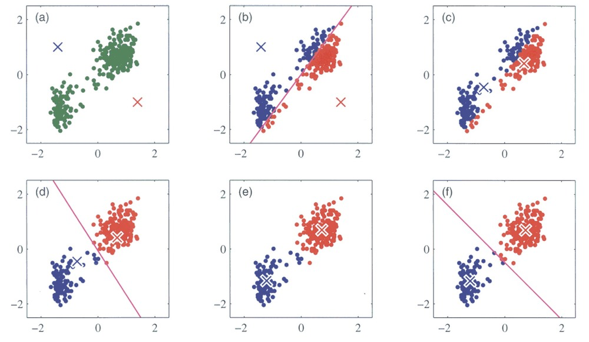
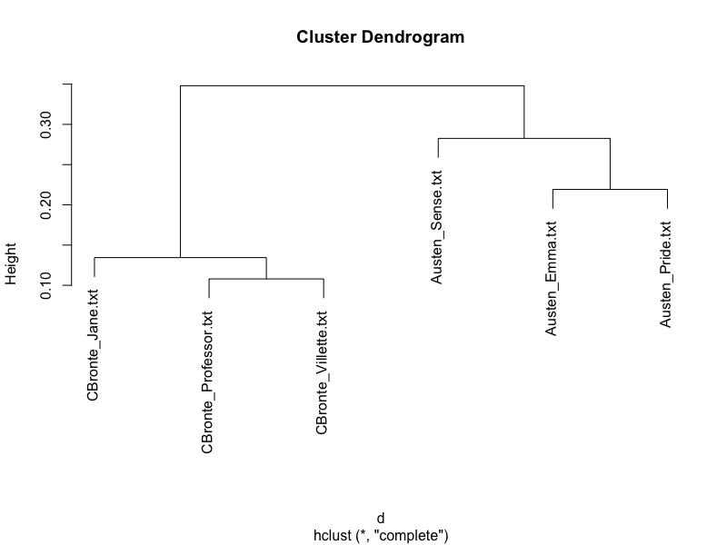

```{r setup, include=FALSE}
knitr::opts_chunk$set(
  comment = "#>",
  collapse = T,
  cache = F,
  out.width = "70%",
  fig.align = 'center',
  fig.width = 6,
  fig.asp = 0.618,  # 1 / phi
  fig.show = "hold"
)
```

```{r include=FALSE} 
# include any code here you don't want to show up in the document,
# e.g. package and dataset loading
require(tidyverse)
require(kableExtra)
require(stringr)
require(quanteda)
```

class: middle

### Cluster analysis / Clustering

- Goal is to ascertain, on the basis of $x_1, x_2, ..., x_n$ , whether the observations fall into relatively distinct groups.

- These groups are interesting because the may correspond to some category or quantity of interest.

---
class: middle, center

```{r echo=F}

```

---
class: middle, center

```{r echo=F, out.width="100%"}

```

---
### Game Plan

.accent[Today]: Cluster press releases

</br>
.accent[Goal]: partition documents such that:
- similar documents are together 
- dissimilar documents are apart

</br>
.accent[Method]: Clustering methods
1. What makes two data points (i.e. documents) similar? 
2. How do we find a good partition?
3. How do we interpret the clusters?

---
### Key Terms
- (Multidimensional) Space
- Distance
- Euclidean Distance
- Cosine Distance
- Cluster Analysis / Clustering 
- K-means
- Centroid
- Hierarchical Clustering
- Dendrogram

---
class: inverse, title-slide, middle, center

# K-means clustering

---
### K-Means Clustering

.accent[K-means] clustering is popular method to partition a data set into $K$ distinct, non-overlapping clusters.  


--
**Inputs**

1. A document term matrix (or any multidimensional dataset)
2. $\boldsymbol{K}$ : the desired number of clusters. 


--
Then the $\boldsymbol{K}$ -means algorithm will assign each observation into exactly one of the $\boldsymbol{K}$ clusters. 


--
**Outputs**

1. $\boldsymbol{C_k}$: The set of observations assigned to each cluster. 
2. $\boldsymbol{\mu_k}$: The mean for each $\boldsymbol{K}$ -- a vector representing the average values of all observations in  that cluster. Also called .accent[centroid.]


---
### K-Means Clustering

```{r echo=F, out.width="100%"}

```


---
### K-Means Clustering: Outputs

Centroid ( $\boldsymbol{\mu_k}$ ): The mean for each $\boldsymbol{K}$ -- a vector representing the average values of all observations in that cluster. 


--
Consider the following cluster with two vectors:

<div class="math">
\begin{eqnarray}
\boldsymbol{X_1} & = & [1, 0, 3] \nonumber \\
\boldsymbol{X_2} & = & [0, 4, 1] \nonumber 
\end{eqnarray}
</div>


--
Then its mean is:

<div class="math">
\begin{eqnarray}
\mu  & = &  [\text{mean}(X_{1,1}, X_{2, 1}), \text{mean}(X_{1,2}, X_{2, 2}), \text{mean}(X_{1,3}, X_{2, 3}) ]  \nonumber  \\ 
\mu & = &  [0.5, 2, 2] \nonumber 
\end{eqnarray}
</div>


--
.accent[The K-means algorithm will assign each observation to the cluster with the closest mean.]

---
### K-Means Clustering: Example]

**Goal**: Cluster the following documents: 

.content-box-blue[
- `I like to eat broccoli and bananas.`
- `I eat a banana smoothie for breakfast.`
- `Hamsters and kittens are cute.`
- `She adopted a cute kitten.` 
]

---
#### K-Means Clustering: Example

**Inputs**

1. A document term matrix

  .footnotesize[
  |  | **adopt** | **banana** | **breakfast** | **broccoli** | **cute** | **eat** | **hamster** | **kitten** | **like** | **smoothi** |
|:----:|:---------:|:----------:|:-------------:|:------------:|:--------:|:-------:|:-----------:|:----------:|:--------:|:-----------:|
| 1    | 0         | 1          | 0             | 1            | 0        | 1       | 0           | 0          | 1        | 0           |
| 2    | 0         | 1          | 1             | 0            | 0        | 1       | 0           | 0          | 0        | 1           |
| 3    | 0         | 0          | 0             | 0            | 1        | 0       | 1           | 1          | 0        | 0           |
| 4    | 1         | 0          | 0             | 0            | 1        | 0       | 0           | 1          | 0        | 0           |
]


--
2. $\boldsymbol{K}$ : 2 


--
**Outputs**

1. $\boldsymbol{C_k}$: Cluster assignment:
  - $\boldsymbol{C_1}$: [1, 2] 
  - $\boldsymbol{C_2}$: [3, 4] 
  

--
2. $\boldsymbol{\mu_k}$: Cluster means / centroids:

.footnotesize[
|  | **adopt** | **banana** | **breakfast** | **broccoli** | **cute** | **eat** | **hamster** | **kitten** | **like** | **smoothi** |
|:-------:|:---------:|:----------:|:-------------:|:------------:|:--------:|:-------:|:-----------:|:----------:|:--------:|:-----------:|
| $\mu_1$ | 0.0       | 1.0        | 0.5           | 0.5          | 0.0      | 1.0     | 0.0         | 0.0        | 0.5      | 0.5         |
| $\mu_2$ | 0.5       | 0.0        | 0.0           | 0.0          | 1.0      | 0.0     | 0.5         | 1.0        | 0.0      | 0.0         |
]


---
class: middle

#### A chicken and egg problem: 
- Means $\leadsto$ Assignments 
- Assignments $\leadsto$ Means 


--
.large[**How do we find a good partition?**]


---
### K-Means Clustering: Algorithm

1. Randomly initialize $K$ cluster centroids ( $\mu_1, \mu_2, \cdots, \mu_k$ ) in random locations.
2. Repeat:
  - .accent[Assignment]: Assign each observation $\boldsymbol{X}$ to cluster with closest mean $\mu_k$ .
  - .accent[Update]: Calculate new centroids $\mu_k$ by averaging all points assigned to each cluster.

Stop when cluster assignments stop changing.


---
### K-Means Clustering: Algorithm

```{r echo=F}

```

---
### K-Means Clustering: Algorithm

```{r echo=F}

```

---
### K-Means Clustering: Algorithm

```{r echo=F}

```

---
### K-Means Clustering: Algorithm

```{r echo=F}

```

---
### K-Means Clustering: Algorithm

```{r echo=F}

```

---
### K-Means Clustering: Algorithm

```{r echo=F}

```

---
### K-Means Clustering: Algorithm

```{r echo=F, out.width="100%"}

```


---
### K-Means Clustering: Decisions

**Small Decisions with Big Consequences**: 


--
1. .accent[How should we preprocess the data?]
  - k-means are very sensitive to feature scaling / weighting.
  - Common to normalize the DTM in some way, e.g. by dividing each vector by the vector length. 


--
2. .accent[How to chose $K$ ?]
  - User must assign the number of clusters ( $K$ )
  - Different values of $K$ will lead to different partitions. 


--
3. .accent[Random starting values!]
  - Results will depend on the initial (random) cluster centroid assignment (in step 1). 
  - Important to run the algorithm multiple times from different random starting values. 


--

.large[**How do we decide?**]

---
### K-Means Clustering: How do we decide?

#### What makes a good partition?

Two kinds of validation criteria: 

1. **Quantitative evaluation**:
  - A good clustering is one for which the within-cluster variation is as small as possible. 

2. **Qualitative evaluation**:
  - A good clustering is one for which clusters are substantially / semantically interpretable.


---
### Quantitative Evaluation

**Quantitative evaluation**: within-cluster variation is as small as possible. 
- .accent[Within-cluster variation]: a measure of the amount by which the observations within a cluster differ from each other. 
- Common metric: .accent[Sum of Squared Euclidean Distance]

---
### Quantitative Evaluation

For a given document $\boldsymbol{X}$ in cluster $k$, the .accent[squared Euclidean distance] is:

<div class="math">
\begin{eqnarray}
D(\boldsymbol{X}, \boldsymbol{\mu_k})^2 = \sum_{p=1}^{P} (x_{p} - \mu_{kp})^2
\end{eqnarray}  
</div>


--
The .accent[within-cluster sum of squared distances] for a given cluster $C_k$ is:

<div class="math">
\begin{eqnarray}
W(C_k) = \sum_{i \in C_k }  D(\boldsymbol{X}_i, \boldsymbol{\mu_k})^2 
\end{eqnarray} 
</div>

--
Thus our goal is to minimize the .accent[total within-cluster sum of squares]:

<div class="math">
\begin{eqnarray}
\sum_{k=1}^{K}  W(C_k)
\end{eqnarray} 
</div>

---
### Qualitative evaluation  

Clusters are substantially / semantically interpretable. 


--
How do we interpret the clusters? 

--
1. **Manual identification **
  - Sample set of documents from same cluster 
  - Read documents 
  - Assign cluster label by hand  
      - `I like to eat broccoli and bananas.` $\leadsto$ **"food"**
      - `Hamsters and kittens are cute.` $\leadsto$ **"pets"** 

--
2. **Automatic identification** 
  - Use methods to identify separating words between clusters 
  - Use these to help infer differences across clusters  


--
3. **Be** .accent[transparent] 
  - Provide documents + code 
  - Detail labeling procedures
  - Acknowledge ambiguity 

---
class: middle, center, title-slide, inverse

## Hierarchical Clustering

---
### Limitations of K-Means Clustering

1. Pre-specify the number of clusters K.

--
2. Lack of structural representation among clusters.

--
3. Hard assignments to clusters.

---
### Solutions of Hierarchical Clusters

1. Pre-specify the number of clusters $K$ $\leadsto$ no need for pre-specify the number of $K$.

2. Lack of structural representation among clusters $\leadsto$ tree-based representations

3. Hard assignments to clusters $\leadsto$ similarities among clusters

---
### Hierarchical Clustering

**Inputs**

1. A document term matrix (or any multidimensional dataset)
2. $N \times N$ distance matrix: Euclidean, cosine, etc... 


--
Then the $\boldsymbol{K}$ -means algorithm will assign each observation into exactly one of the $\boldsymbol{K}$ clusters. 


--
**Outputs**

.accent[Dendrogram]: tree diagram that visualizes the successive pairing of observations.

---
### Dendrogram

```{r echo=F, out.width="100%"}

```

---
### Hierarchical Clustering Algorithm (Ward's Method)


Step 1: Start with each text (observation) in its own cluster.


--
Step 2: Merge the two closest clusters.
  - Ward's Method: The distance between two clusters is the change in the sum of squared distances when they are merged.
  - Other methods: McQuitty’s Method, Single Linkage, Average Linkage, Complete Linkage, Centroid Linkage, etc...


--
Step 3: Re-calculate pairwise distances and merge next two closest clusters.


--
Step 4: Continue until single cluster remains


--
Step 5: Return tree of cluster-merges

---
class: middle

## To $\texttt{R}$ Code!