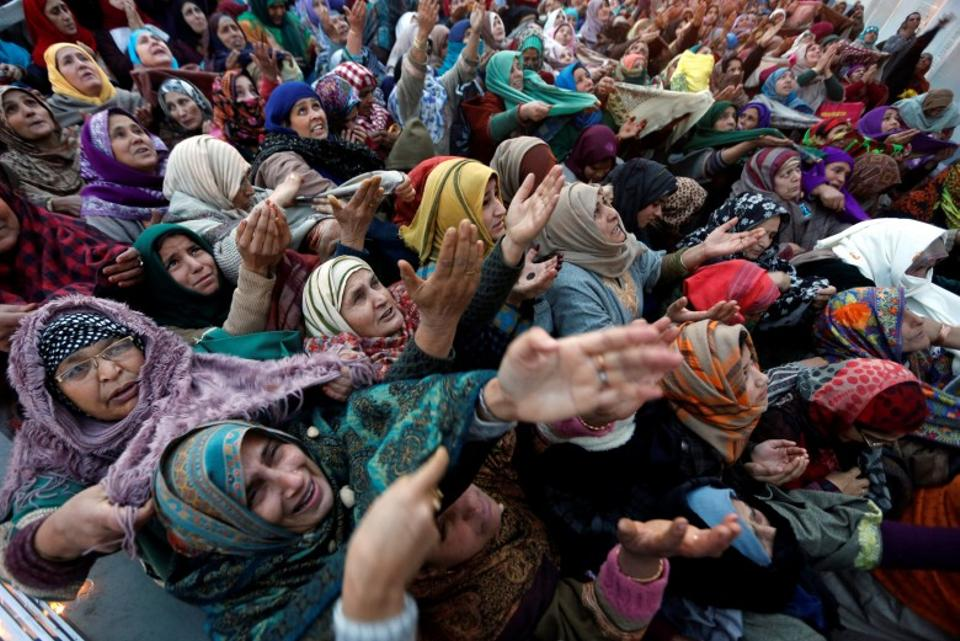
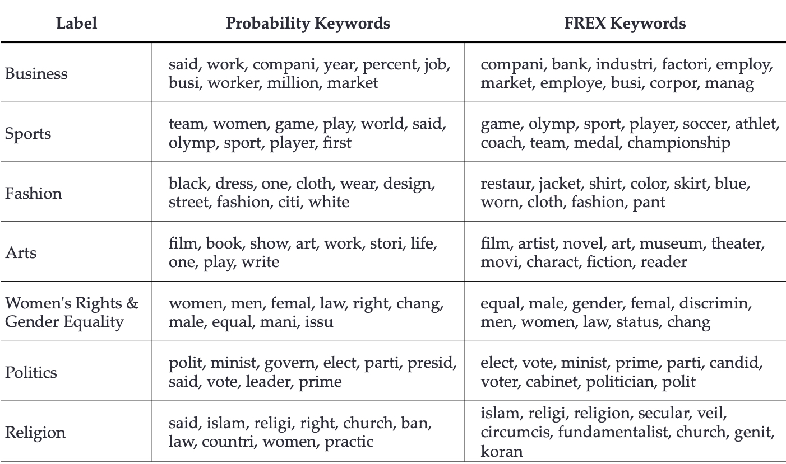
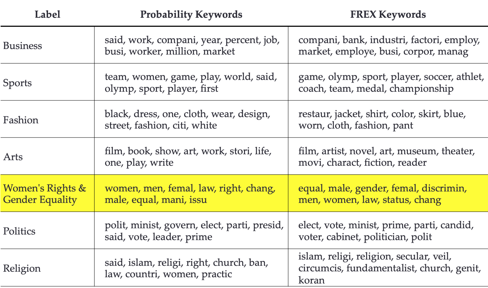
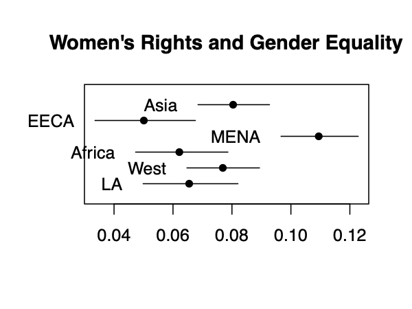

```{r setup, include=FALSE}
knitr::opts_chunk$set(
  comment = "#>",
  collapse = T,
  cache = F,
  out.width = "70%",
  fig.align = 'center',
  fig.width = 6,
  fig.asp = 0.618,  # 1 / phi
  fig.show = "hold"
)
```

```{r include=FALSE} 
# include any code here you don't want to show up in the document,
# e.g. package and dataset loading
require(tidyverse)
require(stringr)
require(quanteda)
```

## Two broad approaches


--
### Supervised methods

We identify what we’re interested in first, and then use computers to extend our insights to a larger population of unseen documents.


--
### Unsupervised methods 

We do not specify the conceptual structure of the texts beforehand. Instead, we use the model to discover a structure that best explains the documents.

---
### Components to Unsupervised Learning Method

.accent[Unsupervised methods]: Discover new ways of organizing texts that are theoretically useful, but perhaps understudied or previously unknown.

--
1. Set of unlabeled documents that we want to classify

--
2. Method to discover categories and then classify documents into those
categories (k-means clustering, topic models)

--
3. Interpretation skills to assign labels to categories and understand what they mean.

---
class: middle, center

```{r echo=F, out.width="100%"}

```

---
### An Example

.accent[Islamophobia and Media Portrayals of Muslim Women] (_International Studies Quarterly_)

--

- **Question**: How do U.S. news media report about women's rights abroad?

--

- **Argument**: U.S. news coverage portrays Muslim societies differently than non-Muslim societies.

--

- **Data**: 35 years of reporting in the *New York Times* and *Washington Post*.

--

- **Method**: Topic Modeling

---
### Today

.accent[Today]: Topic model American news coverage of women abroad

.accent[Goal]: represent each article as a mixture of topics:

- Describe each topic.
- Measure proportion of each article addressing each topic.

.accent[Method]: Latent Dirichlet Allocation (LDA); Structural Topic Modeling (STM)

.accent[Game Plan]:

1. Single versus Mixed Membership models

2. Topic modeling intuition, output, decision points

3. Interpretation and applications

---
### Key Terms:

- Mixed membership model
- Topic models
- Topic and topic proportions
- Latent Dirichlet Allocation (LDA)
- Structural Topic Modeling (STM)

### Key R Packages
- stm

---
### What is Topic Modeling?

.accent[Topic modeling] is an algorithm used to code the content of a corpus into substantively meaningful categories, or "topics," using the statistical correlations between words.

--

It is .accent[unsupervised] because we don't tell it the topics beforehand. The algorithm "discovers" abstract topics that can be thought of as a constellation of words that tend to show up together.

--

It is .accent[mixed membership] because it considers each document to be a .accent[mixture] of different topics.


**Single Membership Models**: Document $\leadsto$ One Cluster

**Mixed Membership Models**: Document $\leadsto$ Multiple Clusters

---
### How does topic modeling work?

.accent[Goal:] Topic model the following documents:

- I like to eat broccoli and bananas.
- I ate a banana and spinach smoothie for breakfast.
- Hamsters and kittens are cute.
- My sister adopted a kitten yesterday.
- Look at this cute hamster munching on a piece of broccoli.


We suspect that this corpus contains 2 topics. We want to reverse engineer those topics from the co-occurrence of words in each document.

---
### How does topic modeling work?

.accent[Goal]: Topic model the following documents:

- I like to .blue[eat broccoli] and .blue[bananas].
- I .blue[ate] a .blue[banana] and .blue[spinach smoothie] for .blue[breakfast].
- .red[Hamsters] and .red[kittens] are .red[cute].
- My sister .red[adopted] a .red[kitten] yesterday.
- Look at this .red[cute hamster] .blue[munching] on a piece of .blue[broccoli].

We suspect that this corpus contains 2 topics. We want to reverse engineer those topics from the co-occurrence of words in each document. 

.blue[Topic A] (interpreted to be about .blue[Food]) 

.red[Topic B] (interpreted to be about .red[Pets])

---
### Latent Dirichlet Allocation

.accent[LDA]: Popular topic modeling method.

--

**Inputs**
1. A Document term matrix (or any multidimensional dataset)
2. .accent[*K*]: the desired number of topics.

--

**Outputs**
1. $\pi_k$: Topic distribution over words.
2. $\theta_i$: Document distribution over topics.

---
### LDA: Outputs


- I like to .blue[eat broccoli] and .blue[bananas].
- I .blue[ate] a .blue[banana] and .blue[spinach smoothie] for .blue[breakfast].
- .red[Hamsters] and .red[kittens] are .red[cute].
- My sister .red[adopted] a .red[kitten] yesterday.
- Look at this .red[cute hamster] .blue[munching] on a piece of .blue[broccoli].

1. **Topic distribution over words** ( $\pi_k$ ).

.footnotesize[
| Topic | broccoli | banana | breakfast | kitten | cute | hamter | like | yesterday | Total |
|-------|----------|--------|-----------|--------|------|--------|------|-----------|-------|
| A     | .30      | .25    | .20       | .01    | .01  | .01    | .12  | .10       | 1     |
| B     | .01      | .01    | .01       | .35    | .24  | .25    | .08  | .05       | 1     |
]

---
### LDA: Outputs


- I like to .blue[eat broccoli] and .blue[bananas].
- I .blue[ate] a .blue[banana] and .blue[spinach smoothie] for .blue[breakfast].
- .red[Hamsters] and .red[kittens] are .red[cute].
- My sister .red[adopted] a .red[kitten] yesterday.
- Look at this .red[cute hamster] .blue[munching] on a piece of .blue[broccoli].

2. **Document distribution over topics** ( $\theta_i$ ) **.**

.footnotesize[
| **Document** | **Topic A Weight** | **Topic B Weight** | **Total** |
|--------------|--------------------|--------------------|-----------|
| **1**        | .99                | .01                | 1         |
| **2**        | .99                | .01                | 1         |
| **3**        | .01                | .99                 | 1         |
| **4**        | .01                | .99                 | 1         |
| **5**        | .60                | .40                | 1         |
]

---
### LDA: Decisions

Small decisions with Big Consequences:

--

1. .accent[How should we preprocess the data?]
  - Topic models are sensitive to feature selection
  - Common to remove sparse words, but there is much debate.
  
--

2. .accent[How to chose *K*?]
  - User must assign the number of topics (*K*)
  - Different values of *K* will lead to different partitions.
  
--

3. .accent[Random starting values!]
  - Results will depend on the intitial assignments.
  - Important to run the algorithm multiple times from different random starting values.
  
--

How do we decide?

---
### What makes a good topic model?


A good topic model is one for which topics are .accent[substantially/semantically interpretable].

How do we interpret the topics?
1. Look at top/distinctive words for each topic.
2. Read most representative documents for each topic.

---
### An Example

.accent[Islamophobia and Media Portrayals of Muslim Women] (*International Studies Quarterly)
- **Question**: How do U.S. news media report about women's rights abroad?

--

- **Argument**: U.S. news coverage stigmatizes Muslim societies as distinctly sexist.

--

- **Data**: 35 years of reporting in the *New York Times* and *Washington Post*. 

--

- **Method**: Structural Topic Modeling

---
### Structural Topic Model


The .accent[structural topic model] is an extension of LDA.

How does the .accent[prevalence] of topics vary across groups of documents (by region, author, etc)?

---

class: middle, center

```{r echo=F, out.width="100%"}

```

---

class: middle, center

```{r echo=F, out.width="100%"}

```

---
### Expected Topic Proportion Across Region


```{r echo=F, out.width="85%"}

```

---
class: middle

## To $\texttt{R}$ Code!


