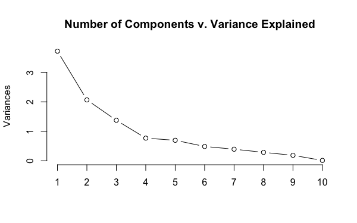

```{r setup, include=FALSE}
knitr::opts_chunk$set(
  comment = "#>",
  collapse = T,
  cache = F,
  out.width = "70%",
  fig.align = 'center',
  fig.width = 6,
  fig.asp = 0.618,  # 1 / phi
  fig.show = "hold"
)
```

```{r include=FALSE} 
# include any code here you don't want to show up in the document,
# e.g. package and dataset loading
require(tidyverse)
require(kableExtra)
require(stringr)
require(quanteda)
```

class: inverse, title-slide, middle, center

## Principal Component Analysis


---
### Exploring Countries

```{r echo=F, out.width="100%"}

```

---
### Exploring Countries

Collected data on over 100 countries, including:

- GDP per capita
- Population
- Regime type
- Military expenditures
- ...  
 
What can we do to understand our data better?

---
### Dimensionality Reduction

**Problem**: Suppose that we wish to visualize $n$ observations with measurements on a set of $p$ features: $X_1, X_2, ... ,X_p$ as part of exploratory data analysis. How do we do it? 


--
**Scatterplots:**

- When $p$ = 2, create a two-dimensional scatterplot 

--
- When $p$ = 3: create 3 scatterplots ( $X_1 \text{ by } X_2, X_1 \text{ by } X_3, X_2 \text{ by } X_3$ ),  

--
- When $p$ = 10: create 45 plots??? 

--
- When $p$ is large $\leadsto$ impossible to look at all of them! 
 
 
 
--
**Solution**: We want to find a low-dimensional representation of the data that captures as much information as possible. This is called .accent[dimensionality reduction]. 

---
### Why Dimensionality Reduction?

Can be used for:

- data summary / exploration
- data visualization (of observations, or variables)
- producing features for use in supervised learning problems. 
- data compression (use less memory)


---
### Game Plan

.accent[Goal]: summarize data in a lower-dimensional space

.accent[Method]: Principal-Component Analysis

.accent[Key Terms]:
- Dimensionality Reduction
- Projection
- Principal Component Analysis (PCA)
- Centered
- Scaled
- PC loadings
- PC scores
- Biplot
- Scree Plot
- Proportion of variance explained (PVE)
- Elbow


---
### What does it mean to reduce data?

How do we reduce this data from 2 dimensions to 1 dimension?

```{r echo=F}
knitr::include_graphics("img/Plot1.jpg")
```

---
### What does it mean to reduce data?

Identify a new dimension on which to .accent[project] (aka "map" or "embed") the data.

```{r echo=F}
knitr::include_graphics("img/Plot9.jpg")
```

---
### What does it mean to reduce data?

.accent[Projecting] a point simply means finding the location on the line which is closest to the point.

```{r echo=F}
knitr::include_graphics("img/Plot12.jpg")
```

---
### What does it mean to reduce data?

We can now represent each point with this new feature ( $z_1$ ).

2 dimensions (on $x_1$ and $x_2$) $\rightarrow$ 1 dimension (on $z_1$ )

```{r echo=F}
knitr::include_graphics("img/Plot12.jpg")
```

---
### From 3D to 2D 

```{r echo=F, out.width="100%"}

```

---
### Principal Component Analysis

.accent[Principal Component Analysis (PCA)] is a popular way to reduce dimensionality. 


- Each of the $n$ observations lives in $p$ -dimensional space, but not all of these dimensions are equally interesting. 


--
- PCA seeks a small number of dimensions that are as interesting as possible.


--
- By *interesting*, we mean the amount that the observations vary along each dimension. 


---
### What are principal components?

PCA finds directions of .accent[maximal variance.]


--
- **First** principal component: direction along which the observations vary the most. 

--
- **Second** component: direction of second greatest variance, and is .accent[orthogonal] (perpendicular) to the first component. 

--
- **Each succeeding component** in turn has the highest variance possible under the constraint that it is orthogonal to the preceding components. 
- Finds up to $p$ unique components. 

???
If we projected the points onto that line, and calculated the variance, the variance would be highest. Projecting points just onto x dimension, computing variance is something that captures distribution between here and here. Similarly for y axes. Just looking at second feature y. But if we chose a line that was 45 degrees, we would have a lot greater variance

---
### Another interpretation of PCs

The .accent[first principal component] defines the line that is as close as possible to the data (using average squared Euclidean distance).

```{r echo=F, out.width="100%"}

```

---
### What are principal components?

```{r echo=F}
knitr::include_graphics("img/pca.png")
```

---
### PCA Inputs

For PCA to work, the features should be .accent[preprocessed] in a particular way. 

--
1. .accent[Centered] to have mean zero (i.e. de-meaning).
  - Compute mean of each feature.
  - Subtract each value of a feature by the mean of that feature.
  - `colMeans(feature) = 0` 

--
2. .accent[Scaled] for comparability.
  - Different features on different scales or units of measurement (number of bedrooms versus price of house)
  - Rescale variables to have comparable ranges of values 
  - `standard deviation(feature) = 1`


---
### PCA Outputs

K principal components are computed via eigen decomposition. 


- $\boldsymbol{w}_{k}$ : Principal component .accent[loadings]: Unit vector defining direction of given component (length of $p$ ). In other words: How much is given component weighted towards a each variable?  

$$
\begin{eqnarray}
\boldsymbol{w}_{1} & = & (w_{1}, w_{2}, \dots, w_{p}) \nonumber  \\ 
\boldsymbol{w}_{k} & = & (w_{1k}, w_{2k}, \dots, w_{pk}) \nonumber  
\end{eqnarray}
$$


- $\boldsymbol{z}_{i}$: Principal component .accent[scores]: projected values for each observation given component (length of $n$)

$$
\begin{eqnarray}
\boldsymbol{z}_{1} & = & (z_{1}, z_{2}, \dots, z_{n}) \nonumber \\ 
\boldsymbol{z}_{k} & = & (z_{1k}, z_{2k}, \dots, z_{nk}) \nonumber  
\end{eqnarray}
$$

- Principal component .accent[eigenvalues]: defines *interestness* of each component.


---
### An Example: Countries

Collected data on over 100 countries, including:

1. `idealpoint`: idealpoint preference based on UN votes, relative to US.
2. `polity2`: regime type (autocatic<--->democratic)
3. `democ`: Institutionalized Democracy
4. `unreg`: UN region 
5. `physint`: CIRI physical integrity score
6. `speech`: CIRI freedom of speech score
7. `gdp.pc.wdi`: GDP per capita, current US$ (World Bank Development Indicators)
8. `pop.wdi`: WDI population mid-year estimates (World Bank Development Indicators), logged
9. `cinc`: Composite Index of Military Capabilities from Correlates of War
10. `domestic9`: Domestic Conflict / Stability Index, from Banks 2012.

---
### An Example: Countries

1. Standardize each variable to have mean of 0 and standard deviation 1. 
2. Compute 2 principal components. For each PC:
  - Loading vector: length $p = 10$ .
  - Score vector: length $n = 107$ . 
3. Plot PC1 against PC2.

---
### Biplot

```{r echo=F, out.width="90%"}

```

???
The first two principal components for the USArrests data. 
The blue state names represent the scores for the first two principal components. 
The orange arrows indicate the first two principal component loading vectors (with axes on the top and right). 
For example, the loading for Rape on the first component is 0.54, and its loading on the second principal component 0.17 (the word Rape is centered at the point (0.54, 0.17)). 
This figure is known as a biplot, because it displays both the principal component scores and the principal component loadings.
PC1: corresponds to a measure of overall rates of serious crimes. Assault, Rape, and Murder area all correlated with each other.
PC2: corresponds to the level of urbanization of the state

---
### How much variation is explained by each principal component?

.accent[Scree Plot]: Visualize .accent[proportion of variance explained (PVE)] by each component 

```{r echo=F}

```

---
### How many components do we need?

We choose the smallest number of principal components required to explain a sizable amount of variation in the data. 

</br>
--
Eyeball the scree plot, and look for the .accent[elbow] (the point at which the proportion of variance explained by each subsequent principal component drops off.)

---
### Example: Analyzing Indian Treaties

.small[Spirling, Arthur. "U.S. Treaty Making with American Indians: Institutional Change and Relative Power, 1784–1911." American Journal of Political Science 56, no. 1 (2012): 84–97.]


--
**Kernel PCA**: a single dimension characterizes treaties as more or less "harsh" in land and resource cession terms.

```{r echo=F}

```

---
### Example: Analyzing Indian Treaties

```{r echo=F}

```

---
### Related ideas: Factor analysis

|             |                                        PCA                                        |                                                        FA                                                        |                                                 |
|-------------|:---------------------------------------------------------------------------------:|:----------------------------------------------------------------------------------------------------------------:|-------------------------------------------------|
| **Goal**        | Reduce dimensionality by decomposing the data into a smaller number of components |        Understand the underlying 'cause' that explain the covariances or correlations between  variables.         |
| **Assumptions** | None                                                                              | Latent variables (or factors) exist in the given data.                                                           |                                                 |
| **Meaning**     | Components = linear combinations of the original variables.                       | Original variables = linear combinations of the factors.                                                         |                                                 |
| **Model**       | Components are orthogonal linear combinations that maximize total variance.       | Factors are linear combinations that maximize the shared portion of the variance--underlying "latent constructs" |                                                 |
  

---
### Related ideas: 

#### Correspondance analysis

Used when data is categorical.


--
#### Multidimensional Scaling

Visualizes data by displaying relative positions of observations that proximate the pairwise distances between them.

---
class: inverse, title-slide, middle, center

## Ideological Scaling

---
### Ideological Scaling

Political actors are often organized on a left-right spectrum, but these positions are **unobservable** and must therefore be treated as a **latent variable** in empirical work. 

</br>

--
How do we measure ideology?

---
### Supervised Approach: Wordscores (Laver, Benoit & Garry, 2003)

--
#### Motivation: Widespread interest in scaling political texts relative to one another
- are parties moving together over time, such that manifestos are converging?
- do members of parliament speak in line with their constituency’s ideology? 
- Roll calls sometimes uninformative.


--
#### Workflow:

--
1. Begin with a reference set (training set) of texts that have known positions.
  - e.g. we find a 'left' document and give it score −1; and a 'right' document and give it score 1 


--
2. Generate word scores from these reference texts


--
3. Score unlabeled texts using those word scores, possibly transform  scores to original metric (-1 to 1).

---
### Supervised Approach: Wordscores (Laver, Benoit & Garry, 2003)

```{r echo=F}
knitr::include_graphics("img/wordscores.png")
```

---
### Unsupervised Approach: Wordfish (Slapin & Proksch, 2008)

--
#### Unsupervised: no need for reference texts
- assumes speaker has a position in low-dimensional political space $leadsto$ rate at which words are used.
- word usage is independent of other words (naive Bayes assumption), drawn from Poisson distribution.
- German party manifestos over time.


--
#### Workflow:

--
1. Begin with an unlabeled set of texts that are thought to have some ideological position


--
2. Estimate:
  - $\beta_p$ word-specific weight: importance of this word in discriminating between party positions
  - $\theta_i$ estimate of party's position in a given year

---
### Unsupervised Approach: Wordfish (Slapin & Proksch, 2008)

```{r echo=F}
knitr::include_graphics("img/wordfish1.png")
```

---
### Unsupervised Approach: Wordfish (Slapin & Proksch, 2008)

.pull-left[
```{r echo=F}

```
]


--
.accent[y-axis] is word fixed effects: words with high fixed effects have zero weight (very common).

.accent[x-axis] is word weights: those with high (absolute) weights discriminate well.

---
### Unsupervised Approach: Cautions

.accent[Ideological dominance assumption]: don't assume wordfish captures position on ideological (e.g., left--right) dimension.
- German party platforms: heavily ideological speech $\leadsto$ reliable position estimates. 
- Senate press releases: nonideological speech $\leadsto$ some other dimension (e.g, position taking--credit claiming.


---
class: middle

## To $\texttt{R}$ Code!
