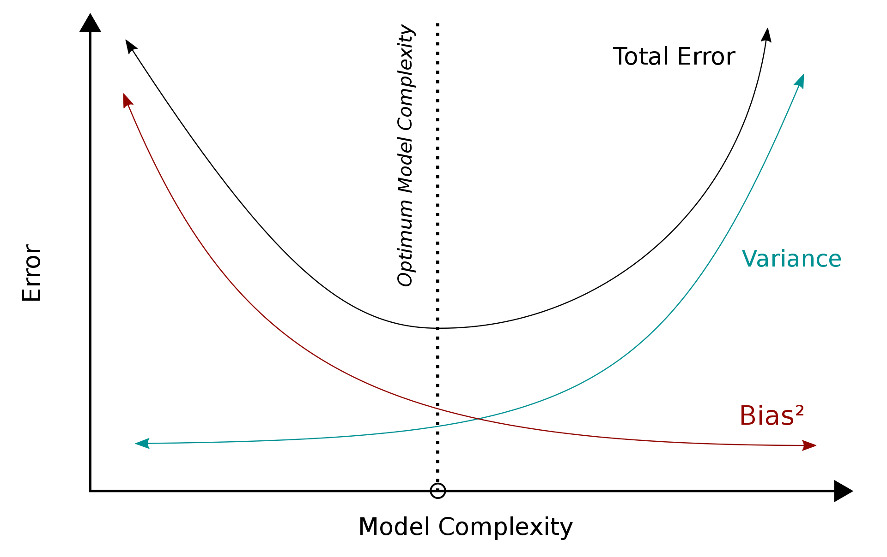

```{r setup, include=FALSE}
knitr::opts_chunk$set(
  comment = "#>",
  collapse = T,
  cache = F,
  out.width = "70%",
  fig.align = 'center',
  fig.width = 6,
  fig.asp = 0.618,  # 1 / phi
  fig.show = "hold"
)
```

```{r include=FALSE} 
# include any code here you don't want to show up in the document,
# e.g. package and dataset loading
require(tidyverse)
require(kableExtra)
require(stringr)
require(quanteda)
```

## Two broad approaches


--
#### Supervised methods

We identify what we’re interested in first, and then use computers to extend our insights to a larger population of unseen documents.


--
#### Unsupervised methods 

We do not specify the conceptual structure of the texts beforehand. Instead, we use the model to discover a structure that best explains the documents.

---
### Supervised Classification


--
.accent[Dictionary Methods]: Classification without "learning."
  - Dictionary methods are context invariant
  - No optimization step $\leadsto$ same word weights regardless of texts
  - Without optimization $\leadsto$ unclear about dictionaries performance

</br>

--
.accent[Supervised learning methods] are about *learning* relationship between $Y$ (labels) and $X$ (features) from labeled data. 

</br>

--
Sometimes used interchangeably with .accent[machine learning]: idea that computers can "learn" relationships without specific programming.

---
### Key Terms
- Classification
- Accuracy and the Precision/Recall Trade-off
- Overfitting / underfitting
- Bias-Variance Trade-off
- Regularization
- LASSO
- Mean Squared Error (MSE) 
- Cross validation

---
class: middle, center, inverse, title-slide

# Supervised Learning Workflow

---
#### Overview

.footnotesize[
**1. Identify set of known categories $Y$ ** (aka *response, outcome, target, label*)
  - $Y \in$ [ `Positive Tone, Negative Tone` ]
  - $Y \in$ [ `Pro-war, Ambiguous, Anti-war` ]
]

--
.footnotesize[
**2. Code and Preprocess Data** 
  - .accent[Hand-coded documents]:
    - *Training Set*: what we'll use to estimate model
    - *Test/Validation Set*: what we'll use to assess model
  - .accent[Unlabeled documents]:
    - *Unseen Set*: what we'll use the model to categorize
]

--
.footnotesize[
**3. Train Classifier/ Learner ${L}$ ** to learn relationship between ${X}$ and ${Y}$ 
  - dictionary methods, logistic regression, naive bayes etc.
  - Fit (train) predictive function $\hat{Y} = \hat{f}(X)$ to classify unlabeled documents.
]

--
.footnotesize[
**4. Evaluate performance**
  - Compare predicted response value $(\hat{Y})$ with true response value $({Y})$ in test set.
  - Tune (adjust) ${L}$ for optimal performance.
]

--
.footnotesize[
**5. Classify remaining documents **
]

---
### Example (Mitts)

.small[
**Mitts (2019)**: valuates if local anti-Muslim hostility correlates with online support of ISIS.
]

--
.small[
**1. Labels**: $Y \in$ [`Anti-West; Sympathy with ISIS; Life in ISIS territories; Travel to Syria; Syrian War`]. 
]

--
.small[
**2. Hand coding**: 
- Hire approximately 1,000 coders via Amazon MTurk and CrowdFlower to hand-code 30,000 tweets. 
- Three coders worked independently to assign one or more labels to each tweet, and a tweet only retained a label if at least two coders made the same assignment. 
]

--
.small[
**3. Train classifier**
  - Oversampled the pro-ISIS tweets in each language (since they are rare). 
  - elastic net generalized linear model classifier
]

--
.small[
**4. Evaluate performance**: accuracy, precision, and recall all above 0.95.
]

--
.small[
**5. Apply classifier** to label over 100 million tweets from 1.6 million users. This is the final data set for the paper.
]


---
class: inverse, middle, center, title-slide

# Constructing a training set


---
### Constructing a training set

--
#### Selecting Documents:
- random sample to obtain a representative sample of documents.
- stratify (e.g., up-sample minority categories) if necessary.


--
#### How Many?
- 500? (Hopkins and King 2010)
- 70-80%?
- More categories $\leadsto$ more training data.
- Not unusual to also split labelled set into training and validation (80/20).


---
### Coding Schemes

.accent[Humans should be able to classify documents into the categories you want the machine to classify them in!]


--
**Creating codebooks**
1. Write set of coding rules.
2. Have coders code an initial set of documents. 
3. Assess coder agreement.
4. Using information and discussion, identify sources of disagreement.
5. Revise codebook and apply to a new set of documents.
6. Repeat until codebook stabilizes. 


--
**Practical tips**
1. Make a survey.
2. Validate responses (eg, if date field, force date type).
3. Always include UIDs.


--
**Try it out**: [tinyurl.com/tad-survey](tinyurl.com/tad-survey)

---
### Inter-rater reliability (IRR)

.accent[IRR]: Measures agreement among independent coders.


--
.accent[Joint agreement]: percentage of time raters agree. 

```{r echo=F, out.width="60%"}
knitr::include_graphics("img/interrater.png")
```

--
Doesn't take into account agreement that occurs by chance.

---
### Inter-rater reliability

.accent[IRR]: Measures agreement among independent coders.


--
.accent[Kappa]: takes into account agreement expected by chance. Rules of thumb:

```{r echo=F, out.width="60%"}

```

--
For supervised methods to work: maximize coder agreement (without cheating!)

---
class: inverse, middle, center, title-slide

# Classifiers / Learners

---
### Classification: Two Estimation Goals


--
1. Probability: $\widehat{\text{Pr}(Y_{i} = 1} | \boldsymbol{x}_{i} )$ 
</br>

--
2. Classification: $\widehat{Y_{i} }  = I (\widehat{\text{Pr}(Y_{i} = 1 | \boldsymbol{x}_{i} )} > t)$ , where $t$ is a threshold.

$$
\begin{eqnarray}
\widehat{Y_i} & = & 1 \text{ if } \widehat{p_i} > t \\
\widehat{Y_i} & = & 0 \text{ if } \widehat{p_i} \leq t
\end{eqnarray}
$$

---
### Binary vs. Multiclass


--
.pull-left[
.footnotesize[
**Binary Classification**
- `Spam, Not Spam`
- `Positive Tone, Negative Tone` 
- $Y \in$ [ 1, 0 ]
]]


--
.pull-right[
.footnotesize[
**Multiple Classification**
- `Pro-war, Ambiguous, Anti-war` 
- `inflation, abortion, democracy, crime`
- $Y \in$ [ 1, $\dots, K$ ] 
]]


--
.footnotesize[
**Transformation to Binary**

For each category $k \in$ [1, $\dots, K$ ]:

1. construct a new label vector $Z$ where $Z_i = 1$ if $Y_i = k$ and $Z_i = 0$ otherwise.
  - $Y =$ { `Pro-war, Pro-war, Ambiguous, Anti-war, Ambiguous` }
  - $Z_{\text{Pro-War}} =$ {1, 1, 0, 0, 0}
  - $Z_{\text{Ambiguous}} =$ {0, 0, 1, 0, 1}
  - $Z_{\text{Anti-War}} =$ {0, 0, 0, 1, 0}

2. Apply learner $L$ to $X, Z$ to obtain $f_k$ . 

Decide the label $Y_i$ with the highest highest confidence score:
]

$$\hat {Y_i}={\underset {k\in [1\ldots K]}{\arg \!\max }}\;f_{k}(x_i)$$

---
### Multiclass vs Multilabel


---
### Types of Classifiers

#### Individual Learners:

--
- logistic regression 

--
- k-nearest neighbors

--
- naive bayes

--
- decision trees

--
- support vector machines

--
- neural networks. 

--
- and many more!


--
#### Ensambles:

- Super-learning
- Bagging
- Boosting

---
class: inverse, middle, center, title-slide

# Evaluating Performance

---
### Evaluating Classification Performance

Recall division of labelled data:
- **In-sample**: "training" data
- **Out-of-sample**: held-out data, "test" or "validation" data

</br>

--
.accent[Best practice]: evaluate fit with "gold standard" data (held-out, hand-coded)


---
### Types of Errors

```{r echo=F, out.width="60%"}

```

--

|  | Actual Label  | |
|---|---|---|
| **Guess** | Yea | Nay |
| Yea  | True Yea | False Yea |
| Nay | False Nay | True Nay | 


---
### Evaluation Metrics

$$ 
\begin{eqnarray}
\text{Accuracy} & = & \frac{\text{True Yea} + \text{True Nay}} {\text{TrueYea}  + \text{True Nay} + \text{False Yea} + \text{FalseNay} }\\ 
\end{eqnarray}
$$

---
### Accuracy Isn't Enough

```{r echo=F}

```

---
### Evaluation Metrics

$$ 
\begin{eqnarray}
\text{Accuracy} & = & \frac{\text{True Yea} + \text{True Nay}} {\text{TrueYea}  + \text{True Nay} + \text{False Yea} + \text{FalseNay} }\\ 
\\
\\
\text{Precision} & = & \frac{\text{True Yea}}{\text{True Yea} + \text{False Yea}} \\
\\
\\
\text{Recall (Sensitivity)} & = & \frac{\text{True Yea}}{\text{True Yea} + \text{False Nay}} \\
\\
\\
F & = & \frac{2\times\text{Precision}\times\text{Recall}}{\text{Precision} + \text{Recall}}    
\end{eqnarray}
$$

---
### Precision-Recall Tradeoff
```{r echo=F}

```


---
### Area Under the Curve

#### Receiver operating characteristic (ROC) curve:

```{r echo=F}
knitr::include_graphics("img/Roc_curve.svg.png")
```


---
### Sometimes Classifier Performance is Substantively Meaningful

```{r echo=F}

```


- Use machine to classify left (−1) vs right (+1) MPs in UK and record classification accuracy. 
- When high, parties are more polarized.
- Makes sense in terms of historical record!

---
class: middle, center, inverse, title-slide

# Bias-Variance Trade-off

---
### Evaluating Classification Perforance

Recall division of labelled data:
- **In-sample**: "training" data
- **Out-of-sample**: held-out data, "test" or "validation" data


#### Why evaluate fit with out-of-sample data?


---
### Regression with Many Predictors

.small[
|          | **Word1** | **Word2** | **Word3** | $\dots$ | **WordP** |
|----------|-----------|-----------|-----------|--------------|-----------|
| Doc1     | 1         | 0         | 0         | $\dots$     | 3         |
| Doc2     | 0         | 2         | 1         | $\dots$     | 0         |
| $\vdots$ | $\vdots$  | $\vdots$  | $\vdots$  | $\ddots$     |
| DocN     | 0         | 0         | 0         | $\dots$     | 5         |
]


--
$\boldsymbol{X} = {N} \times{P}$ matrix 

- ${N} =$  Number of documents 
- ${P} =$  Number of features  
- $\boldsymbol{x}_{i}  = (x_{i1}, x_{i2}, \dots, x_{iP})$  


--
Let $p = \text{Pr}(Y_i = 1))$ 

$$
\begin{eqnarray}
p & = & \beta_0 + \beta_1 X_1 + \beta_2 X_2 + ... + \beta_P X_P \\
p & = & \sum_{p =1}^{P} \beta_P X_{ip} 
\end{eqnarray}
$$

---
### Curse of Dimensionality 

Rules for regression coefficients to exist: 

1. Number of observations ( $N$ ) $>$ Number of predictors ( $P$ )  
2. Predictors $\leadsto$ distinct (i.e. not highly correlated)  

If (1) and (2) are close to false, predictions become .accent[highly variable] 


</br>
--
.accent[Curse of Dimensionality]: When feature matrix is large (e.g., 100k columns) and sparse (mostly zeros).

--
#### $\leadsto$ overfitting


---
### Overfitting

```{r echo=F, out.width = "100%"}
knitr::include_graphics("img/under_over_fitting.jpeg")
```

---
### In-Sample Fit
In sample fit is .accent[greedy]: adding more variables will always improve fit.

```{r echo=F}

```


???
This is a fundamental property of statistical learning that holds regardless of the particular data set at hand and regardless of the statistical method being used. As model flexibility increases, training error will decrease, but the test error may not. When a given method yields a small training error but a large test error, we are said to be overfitting the data. 

This happens because our statistical learning procedure is working too hard to find patterns in the training data, and may be picking up some patterns that are just caused by random chance rather than by true properties of the unknown function f. 

---
### In-Sample Fit

```{r echo=F, out.width = "40%"}

```

Model .accent[overfit] $\leadsto$ in sample error is .accent[optimistic]: 

--
- Some model complexity captures .accent[systematic] features of the data (both training and test sets). 
  - Reduces error in both training and test set. 

--
- Additional model complexity: .accent[idiosyncratic] features of the training set. 
  - Reduces error in training set, increases error in test set.


---
### Bias-Variance Decomposition

$$\text{total error} =  \text{Variance(Predictions)} + \text{Bias(Predictions)}$$ 

--
.accent[Bias]: error from erroneous assumptions in the learning algorithm. High bias can cause an algorithm to miss the relevant relations between features and target outputs (underfitting).


--
.accent[Variance]:  error from sensitivity to small fluctuations in the training set. High variance can cause an algorithm to model the random noise in the training data, rather than the intended outputs (overfitting).


---
### Bias-Variance Trade-off

```{r echo=F}
knitr::include_graphics("img/bias-variance-tradd.jpg")
```

---
### The Goal

Find the sweet spot between bias and variance using out-of-sample data.

```{r echo=F}

```

---
class: inverse, title-slide, middle, center

# To R Code!

---
class: inverse, title-slide, middle, center

# LASSO


---
### Overcoming overfitting

1. Reduce number of features.
  - Manually select which features to keep.
  - Model selection algorithm. 

2. .accent[Regularization]
  - Keep all features, but shrink magnitude / value of parameters close to zero (ridge).
  - Keep all features, but shrink magnitude / value of (some) parameters to zero (lasso).

---
### LASSO Regression

.accent[LASSO] ("least absolute shrinkage and selection operator"): a regularization procedure that shrinks regression coefficients toward zero. 


--
Document $i$ , $(i = 1, \dots, N)$ 

Count vector $\boldsymbol{x}_{i}$

Labels $Y_{i}$ 


--
.accent[Linear regression]: Choose $\boldsymbol{\beta}'s$ to minimize sum of squared residuals.

$$
\begin{eqnarray}
\boldsymbol{\beta}_{\text{OLS}} & = & \text{argmin}_{\boldsymbol{\beta}}  \sum_{i=1}^{N} \left(Y_{i}  - \boldsymbol{\beta}\cdot \boldsymbol{x}_{i}   \right )^2 
\end{eqnarray}
$$

--
.accent[LASSO Regression]: Choose $\boldsymbol{\beta}'s$ to minimize sum of squared residuals and penalty on size of coefficients

$$
\begin{eqnarray}
\boldsymbol{\beta}_{\text{LASSO}} & = & \text{argmin}_{\boldsymbol{\beta}}  \sum_{i=1}^{N} \left(Y_{i}  - \boldsymbol{\beta}\cdot \boldsymbol{x}_{i}   \right )^2  + \underbrace{\lambda \sum_{p=1}^{P}| \beta_{p}| }_{\text{penalty}} 
\end{eqnarray}
$$

--
What does $\lambda$ do?

---
### LASSO Penalty: Algebra

Why does LASSO shrink coefficients to 0?


--
Contrast $\beta = (\frac{1}{\sqrt{2}},\frac{1}{\sqrt{2}} )$ and $\tilde{\beta} = (1, 0)$ 


--
Penalty for Coefficients:
$$
\begin{eqnarray}
\sum_{j=1}^{2} |\beta_{j}| & = & \frac{1}{\sqrt{2}} + \frac{1}{\sqrt{2}}  = \sqrt{2} \\
\sum_{j=1}^{2} |\tilde{\beta}_{j}| & = & 1 +0 = 1 
\end{eqnarray}
$$


---
### LASSO Penalty: Geometry

```{r echo=F, out.width="100%"}

```

---
### LASSO is a Biased Estimator

Introducing bias can help minimize variance, leading to better performance.

```{r echo=F}

```

--
.accent[This is what lasso does!]


---
### How Do We Choose $\lambda$?

- Best $\lambda \leadsto$ best performing model

--
- Best performing model $\leadsto$ lowest mean squared error (MSE). 


--
.accent[Mean squared error (MSE)]: performance metric used to evaluate between competing models. 


--
Define: 
$$
\begin{eqnarray}
\widehat{\boldsymbol{\beta}}^{\lambda} &= & \text{Coefficients at } \lambda  \\
\widehat{p}_{i, \lambda} & = & \text{Pr}(Y_{i} = 1 | \boldsymbol{X}_{i},\widehat{\boldsymbol{\beta}}^{\lambda})  \\  \\
\text{MSE} & =&  \frac{\sum_{i=1}^{N}\left(Y_{i}  - \widehat{p}_{i, \lambda} \right)^{2}}{N}  
\end{eqnarray}
$$

---
### Loss Function

Goal: Find $\lambda$ that minimizes MSE (loss function). 

--
- Optimize in-sample fit?


--
- Optimize out-of-sample fit?


---
class: inverse, title-slide, middle, center

# Cross Validation

---
### Cross Validation: Some Intuition


Recall optimal division of data: 
- Train: build model
- Test/Validation: assess model 
- Unlabeled: classify remaining documents 


--
K-fold Cross-validation idea: create many training and test sets.  
- Idea: use observations both in training and test sets
- Each step: use held out data to evaluate performance
- .accent[Avoid overfitting] and have context-specific estimates

---
### Cross Validation: How-To Guide

- Randomly partition data into K groups. 
  (Group 1, Group 2, Group3, $\dots$, Group K) 
- Rotate through groups as follows 

```{r echo=F, out.width="100%"}
knitr::include_graphics("img/CV.png")
```

---
### Cross Validation: How-To Guide

```{r echo=F, out.width="50%"}
knitr::include_graphics("img/CV.png")
```


#### Strategy: 

- Divide data into $K$ groups. 
- Train data on $K-1$ groups. 
- Predict values for $K^{\text{th}}$ 
- Calculate average error:
  - Mean square error, Absolute error, Prediction error, ...
- Final choice: model with optimal $CV$ score.

---
### How Do We Select $K$?

.footnotesize[
.accent[Common values of $K$]
- $K = 5$: Five fold cross validation
- $K = 10$: Ten fold cross validation
- $K = N$: Leave one out cross validation (LOOCV)
]

--
.footnotesize[
.accent[Considerations]:
]


--
.footnotesize[
How sensitive are inferences to number of coded documents? (ISL, pg 181-184) 
  - 50 labeled documents
  - $K = N \rightarrow$ 49 documents to train, 
  - $K = 10 \rightarrow$ 45 documents to train
  - $K = 5 \rightarrow$ 40 documents to train 
]


--
.footnotesize[
How long will it take to run models?  
  - $K-$fold cross validation requires $K \times$ One model run 
]

--
.footnotesize[
Bias-Variance in Cross Validation:
  - LOOCV:  Less bias
  - K = 5 or 10: Less Variance
  - In brief: k = 5 or 10 shown to be "sweet spot", yielding low test error estimates.
]

---
class: inverse, title-slide, middle, center

# Extentions

---
### Scaling Political Texts with Wordscores (Laver, Benoit & Garry, 2003)

--
#### Motivation: Widespread interest in scaling political texts relative to one another
- are parties moving together over time, such that manifestos are converging?
- do members of parliament speak in line with their constituency’s ideology? 
- Roll calls sometimes uninformative.


--
#### Workflow:

--
1. Begin with a reference set (training set) of texts that have known positions.
  - e.g. we find a 'left' document and give it score −1; and a 'right' document and give it score 1 


--
2. Generate word scores from these reference texts


--
3. Score unlabeled texts using those word scores, possibly transform  scores to original metric (-1 to 1).

---
### Wordscores

```{r echo=F}

```

---
### ReadMe (Hopkins and King 2010)

LASSO, Naive Bayes, etc...: focused on individual document classification. 


--
But what if we’re focused on proportions only?


--
.accent[Hopkins and King (2010)]: method for characterizing distribution of classes. 
  - Can be much more accurate than individual classifiers
  - Requires fewer assumptions (do not need random sample of documents ) .

---
class: inverse, title-slide, middle, center

# To R Code!

---
class: inverse, title-slide, middle, center

# Bonus Slides

---
### Maximum Liklihood Estimation

- $O$: Observed outcomes  
- $\theta$: Parameters describing the data generating process. 
- Probability: $P(O\vert \theta)$. .accent[But we don't know] $\theta$ ! 
- Likelihood: $L(\theta \vert O) = P(O\vert \theta)$ 
- Find value of coefficients, $\boldsymbol{\beta}^{\text{max}}$ that maximize likelihood $\leadsto$ numerical optimization 
