```{r setup, include=FALSE}
knitr::opts_chunk$set(
  comment = "#>",
  collapse = T,
  cache = F,
  out.width = "70%",
  fig.align = 'center',
  fig.width = 6,
  fig.asp = 0.618,  # 1 / phi
  fig.show = "hold"
)
```

```{r include=FALSE} 
# include any code here you don't want to show up in the document,
# e.g. package and dataset loading
require(tidyverse)
require(stringr)
require(quanteda)
```


## What are word embeddings?

**Word embeddings**: vectors of numbers that represent the meaning of a word.

| Word    | $D_1$          | $D_1$            | $D_1$           | $D_1$           |           $D_1$  |           $D_1$  | ... | $D_{300}$ 
|---------|-------------|--------------|-------------|-------------|-------------:|-------------:|-----|
| France  | 0.015  | 0.018  | 0.083  | 0.009 |  0.016 |  0.007| $\dots$ | -0.012 |
| Germany | 0.060  | 0.046  | 0.063  | 0.002 | -0.063 | -0.026 | $\dots$ | -0.093 |
| wine    | -0.042 | -0.031 | -0.054| 0.033 |  0.002 |  0.048 | $\dots$ | 0.056 |


--
**Characteristics**:
- each word is represented as a vector in a high-dimensional space (typically 300 dimensions)
- each continuous value (or "weight") captures a dimension of the word's meaning 
- semantically similar words are close together in this space
- dissimilar words far away
- Ex: "car" is close to "wheel", while distance from "banana".

---
### Why represent words as vectors?

**Fully relational**: words only have meaning in relation to other words. Parallels post-structuralist models of language.


--
Vectors lend themselves to **mathematical operations**, e.g. adding and subtracting.


---
### Why represent words as vectors?

#### 1. Finding similar words


--
Most similar vectors to the `talk` vector  (using cosine similarity):
- `talking`, 0.6718707084655762
- `speak`, 0.6052849292755127
- `talked`, 0.5983412265777588
- `tell`, 0.5425027012825012
- `conversation`, 0.5362381935119629
- `hear`, 0.5258073806762695
- `know`, 0.5096373558044434
- `think`, 0.4957665205001831
- `listen`, 0.4826739430427551
- `discuss`, 0.47418320178985596


--
Helpful for stemming, lemmatizing, etc.


---
### Why represent words as vectors?

#### 2. Disambiguation


--
The `bank` vector captures multiple meanings of the word: financial institution, side of a river.

To isolate the financial meaning, remove the river meaning dimensions from the bank vector, keeping the financial bank meaning dimensions:

> `bank` - `river` $\approx$ the financial institution


--
Or, add vectors to approximate the vector capturing their conjoint meaning.

> `united` + `states` $\approx$ the country `United States`


---
### Why represent words as vectors?

#### 3. Analogies (claim to fame)


--
Identify analogies using a simple vector offset method based on cosine distance.

> `king` - `man` + `woman` $\approx$ `queen`

We can subtract one meaning from the word vector for `king` (maleness), add another meaning (femaleness), and show that this new word vector (`king — man + woman`) maps most closely to the word vector for `queen.`

---
### Analogous reasoning

--
```{r echo=F, out.width="100%"}
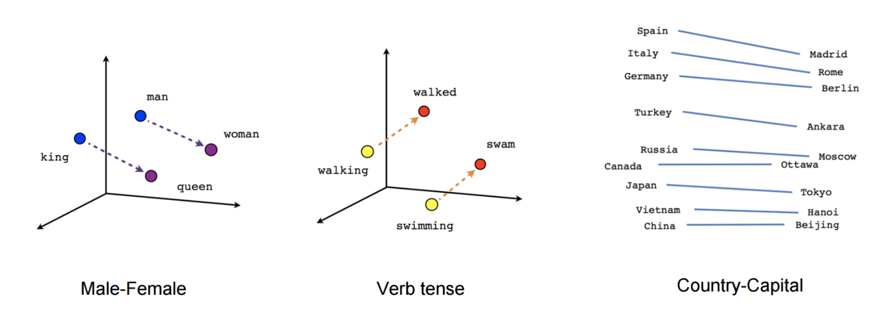
```


--
| Query (a is to b as c is to d?)    | Answer (d)    |
|------------------------------------|---------------|
| `king`:`queen`; `man`: ?              | `woman`         |
| `smart`:`smarter`; `strong`: ?        | `stronger`      |
| `Tokyo`:`Japan`; `Paris`:?            | `France`        |
| `Google`:`Larry Page`; `Microsoft`: ? | `Steve Ballmer` |


---
### What do these dimensions represent?

- each dimension represents a "meaning" 
- a word's weight on that dimension captures its association with that meaning. 


--
```{r echo=F, out.width="85%"}
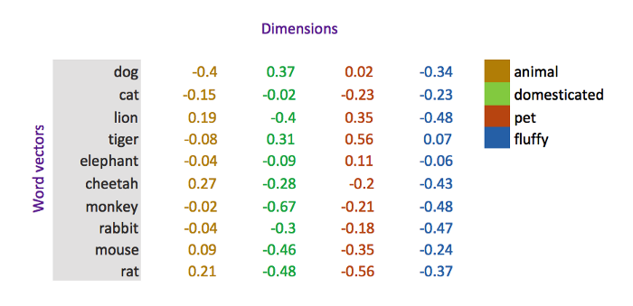
```


--
**Warning: This is huge simplification!** Usually, dimensions do not hold such clearly defined meanings.


---
## Where do word vectors come from?

Firth’s (1957) *distributional hypothesis*:

> “You shall know a word by the company it keeps”

</br>

--
Words that share similar .accent[contexts] tend to have similar meanings.


--
.accent[Contexts] refers to surrounding words.


--

.accent[Context Window]: N words before and after target/center word.

```{r echo=F, out.width="85%"}
knitr::include_graphics("img/context_window.png")
```

---
### Word2Vec

**Supervised task**: for any given word, predict whether another word is likely to appear nearby (i.e., in the context window).


--
The model is **trained** on word, context pairings for every word in the corpus. 


--
Here's an example with a small window size of 2.

```{r echo=F, out.width="80%"}
knitr::include_graphics("img/skipgram.png")
```

[Source](http://mccormickml.com/2016/04/19/word2vec-tutorial-the-skip-gram-model/)

---
### Word2Vec

```{r echo=F, out.width="70%"}
knitr::include_graphics("img/skipgram.png")
```

The algorithm is going to learn from the number of times each pairing shows up.


--
**Training**: more samples of `(Soviet, Union)` than `(Soviet, Sasquatch)`. 


--
**Learning**: if you give it the word `Soviet` as input, then it will output a much higher probability for `Union` or `Russia` than it will for `Sasquatch.`


---
### Neural networks

There are many ways to find patterns of word co-occurences within a context window.


--
Many of the word embedding models currently in use are created using .accent[neural networks].


--
Neural networks are a kind of .accent[deep learning] modeled (loosely) on the human brain.


--
It makes predictions by identifying patterns using .accent["hidden layers"] between inputs and outputs.


--
A .accent[word2vec] model is a neural network with a single hidden layer that was trained to predict the context of words.


---
### How neural networks work

<iframe width="100%" height="80%" src="https://www.youtube.com/embed/aircAruvnKk" title="YouTube video player" frameborder="0" allow="accelerometer; autoplay; clipboard-write; encrypted-media; gyroscope; picture-in-picture" allowfullscreen></iframe>

---
### Word2Vec architecture

Let's say we have corpus with 10,000 unique words.


--
**Input**: target word represented as a one-hot vector (length = 10,000). 


--
**Task**: Try to predict the probability that other words are proximate to the input word.


--
**Output**: a vector (length = 10,000) of probabilities that a given vocabulary word is in the context window of the target.


---
### Word2Vec architecture

```{r echo=F, out.width="80%"}
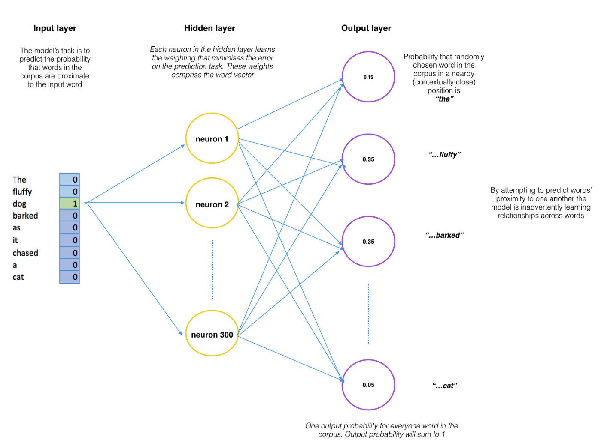
```

[Source](https://towardsdatascience.com/word-vectors-for-non-nlp-data-and-research-people-8d689c692353)

---
### Hidden layers

```{r echo=F, out.width="50%"}

```

Word vectors are a **side effects** of a predictive task, not its output! 


--
We just want to learn this **hidden layer** weight matrix – the output layer we toss!
- the word vector is a learned representation of the input in order to make the best predictions
- these weights form the word vector, i.e. if you have a 300 neuron hidden layer, you will create a 300-dimension word vector for each word in the corpus.


---
### Two types of Word2Vec models

**Skip-Gram Model** 
- predicts the context words, given the center word
- often requires more data for stable representations
- most useful for people who want to identify patterns within texts


--
**Continuous Bag of Words (CBOW)**
- tries to predict the center word, given context
- faster to train
- more useful in practical applications such as predictive web search


---
### Other Algorithms

1. `Word2Vec`: captures whether words appear in similar contexts. Fast, general-purpose, laptop-friendly.

2. `GloVe`: focuses on words co-occurrences over the whole corpus. Scales poorly.

3. `FastText` improves on Word2Vec by taking word parts into account. Enables training of embeddings on smaller datasets and generalization to unknown words.


---
### Training your own Word2Vec:

Using neural networks in R requires interfacing with broader software tools created by Google and others via an API. 


--
- **TensorFlow**: popular platform for building neural networks
- **Keras**: popular API for accessing TensorFlow 
- **`keras` package**: to use Keras in R; attempts to install python and other software for you.

[See this tutorial.](https://blogs.rstudio.com/ai/posts/2017-12-22-word-embeddings-with-keras/)


</br>

--
**Word2Vec on small (less than 1 million words) corpora?**

--
.accent[Think again.]


---
### What if you don’t have enough data?

**Another solution**: 
  - Use pre-trained vectors on large corpora (google news, wikipedia, NYtimes etc.)
  - Example: FastText as pre-trained word vectors for 157 languages! This allows for comparison between languages.
  - Retrofitting: fine tuning pre-trained word vectors on an external corpus


---
class: inverse, middle, center

## Application: Gender bias 

From: "Man is to computer programmer as woman is to homemaker? Debiasing word embeddings." Tolga Bolukbasi, Kai-Wei Chang, James Zou, Venkatesh Saligrama, Adam Kalai. NIPS 2016


---
### Gendered Analogies (Bolukbasi 2016)

```{r echo=F, out.width="85%"}
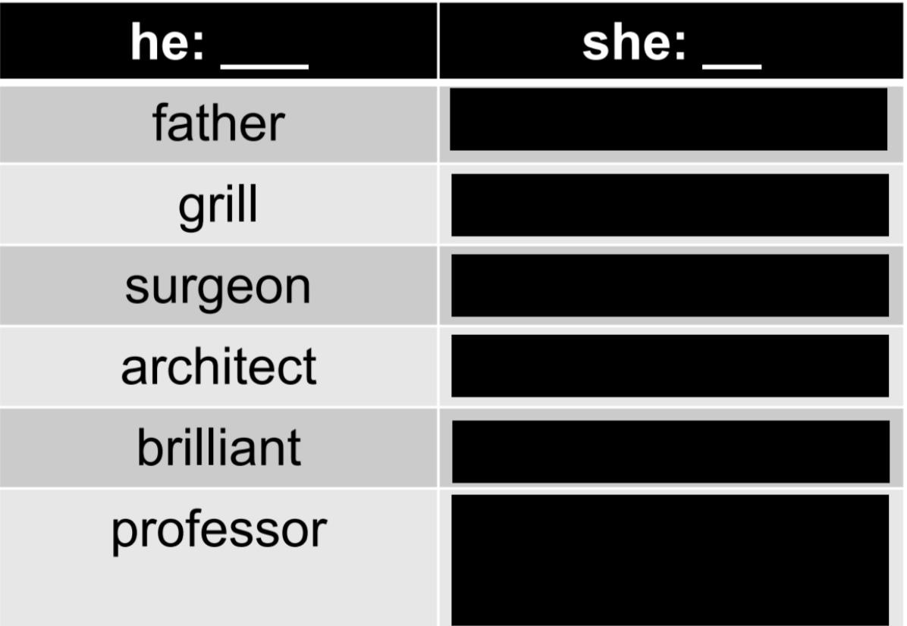
```


---
### Gendered Analogies (Bolukbasi 2016)

```{r echo=F, out.width="85%"}
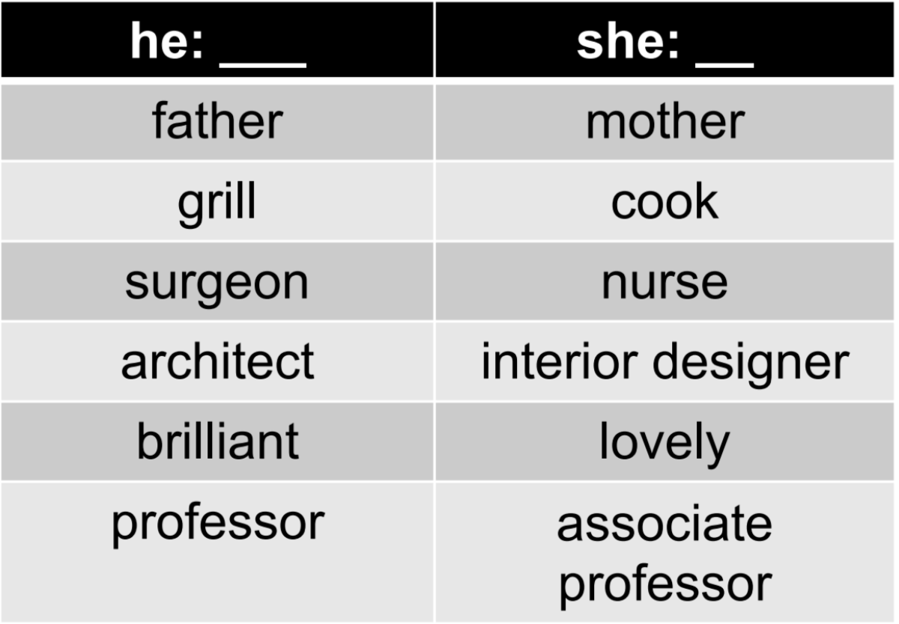
```


---
### How "gendered" are particular words?

1. Create a new "gender" dimension: 
  - select pairs of gender antonym words: `he`/`she`, `him`/`her`, `man`/`woman`, etc
  - average their distances: `mean(he - she, him - her, man - woman, ... )`
  - result is a "gender" dimension.

--
2. Project words onto that gender dimension 
  - map word onto dimension using cosine/euclidian distance
  - finds position of where the word lies on this dimension


---
### Alternative method (Bolukbasi et al 2016)

Principal components!

```{r echo=F, out.width="85%"}
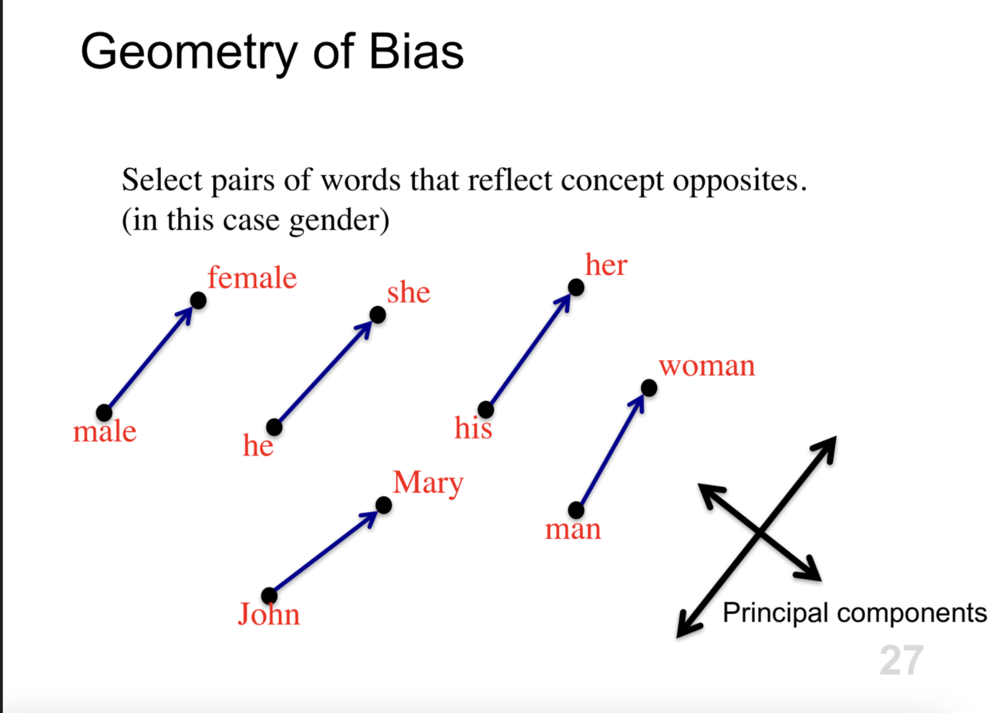
```

---
### Alternative method (Bolukbasi et al 2016)

Principal components!

```{r echo=F, out.width="85%"}
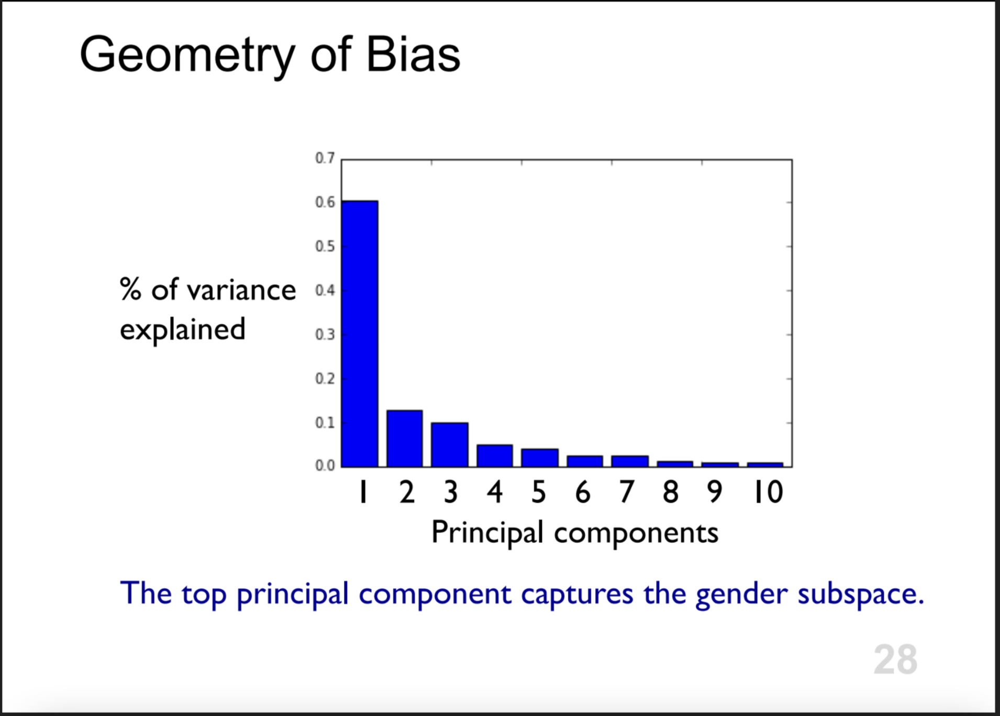
```


---
### Measuring Bias: Occupations (Bolukbasi et al 2016)

```{r echo=F, out.width="85%"}
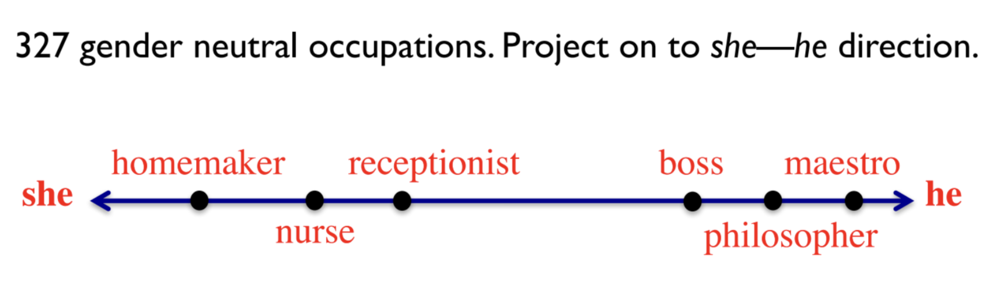
```


---
### Class and Culture (Kozlowski et al. 2019)

**Construct a class dimension**

```{r echo=F, out.width="85%"}
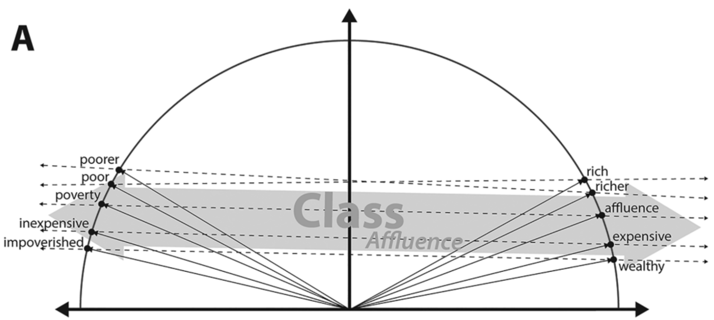
```


---
### Class and Culture (Kozlowski et al. 2019)

**Project words onto that dimension**

```{r echo=F, out.width="85%"}
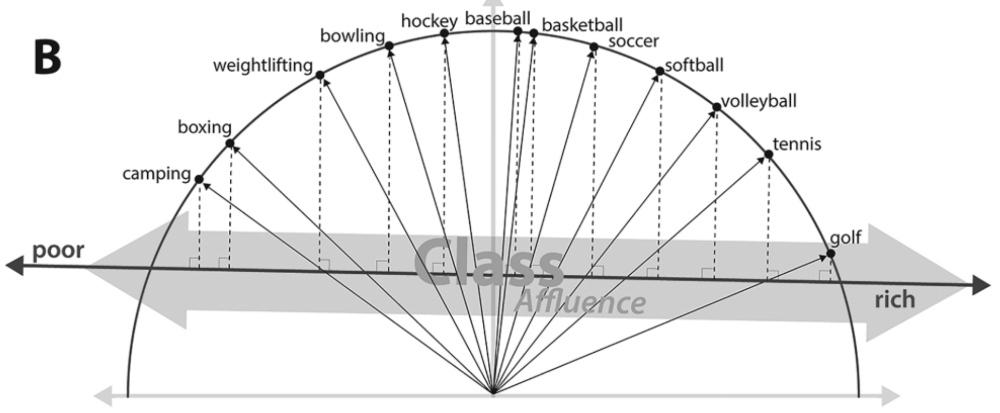
```


---
### Class and Culture (Kozlowski et al. 2019)

**Simultaneous Projection of Words onto Multiple Dimensions**

```{r echo=F, out.width="85%"}
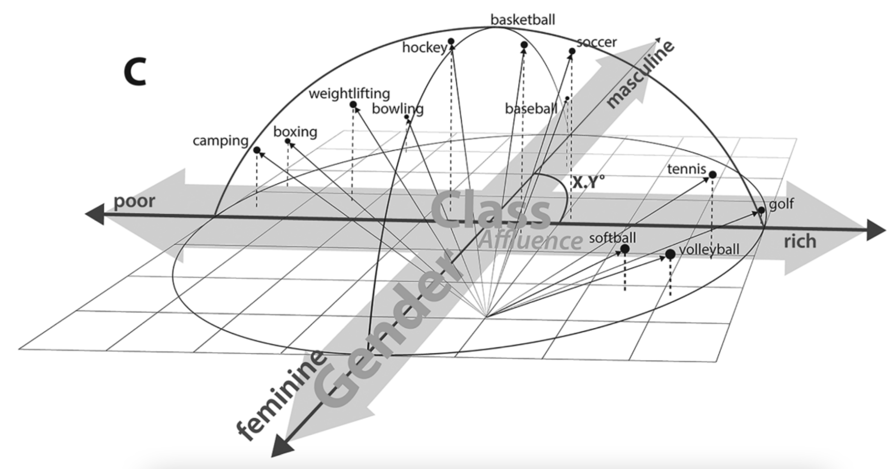
```

---
### Other uses of word embeddings

1. building blocks for more complex tasks: classification, clustering, information retrieval, etc.

--
2. aggregate word vectors (e.g., by averaging) to make sentence, paragraph, or document embeddings


--
See Evans' deep learning class for more.
